# Base de Datos de Mundiales de Fútbol

## Introducción

Este proyecto corresponde al desarrollo de una **base de datos relacional completa** sobre los mundiales de fútbol (`https://www.losmundialesdefutbol.com`), abarcando desde el diseño e implementación del modelo lógico de la base de datos, extracción de datos mediante técnicas de web scraping, pasando por normalización y transformación en Excel para la correcta carga.

El objetivo principal fue estructurar de manera coherente y relacional toda la información disponible sobre:

- **Mundiales:** años, países organizadores, campeones
- **Selecciones:** países participantes, planteles, jugadores
- **Partidos:** resultados, goles, penales, tarjetas, cambios
- **Premios:** Balón de Oro, Botín, Guante de Oro, y otras distinciones
- **Eventos:** todos los sucesos relevantes en cada partido

El proyecto combina herramientas modernas como **Selenium, BeautifulSoup, Python** y **Excel** para asegurar calidad, consistencia y completitud de los datos.

---

## Integrantes

- **Jose Emilio Morales Castillo:** 202300626
- **Diego Alessandro Constanza Padilla:** 202300601
- **Angel Javier Cornejo Gramajo:** 202201130

---

# Cambios realizados en la base de datos:

Todos estos cambios han sido realizados con el objetivo de mejorar el diseño lógico de la base de datos, para así, poder registrar toda la información relevante de los mundiales de fútbol, sin perder ningún detalle importante.

Se han realizado los cambios conforme a la información obtenida por los scrapers, y a la estructura de datos que se tenía en el modelo relacional, para así, poder registrar toda la información relevante de los mundiales de fútbol, sin perder ningún detalle importante.

## Entidad Premio

- Se ha agregado una pk natura o con un id autoincrementable, ya que, existen mundiales en donde 'N' cantidad de participantes ganaron el mismo tipo de premio.
- Se ha quitado la llave primera compuesta (id_tipo_premio, id_mundial) por solo una llave primera simple (id), dado el cambio anterior.

## Entidad Plantel

- Se ha puesto como no obligatorio el atributo 'grupo', ya que, existe un mundial en donde los equipos involucrados no tienen asignado un grupo.

## Entidad No_disponible

- Se ha modificado la relación que se tenía con la etnidad 'Partido', ahora pasó a ser una relación identificadora (error en el diseño lógico). Ya que con esto, ya podríamos tener la capacidad de registrar a los jugadores que no estuvieron disponibles en uno o varios partidos.

## Entidad Tarjeta

- Se ha generado una PK natural de un único atributo (id_tarjeta), ya que, existen partidos en donde a cierto jugador le han sacado más de una tarjeta, indpendientemente del color, en el mismo minuto, por lo que era realmente necesario una PK natura.

---

# Web Scraping: Extracción de Datos

La extracción de datos fue realizada mediante técnicas de **web scraping automatizado**, utilizando múltiples herramientas y estrategias para garantizar la obtención integral de la información disponible en la web.

## Fuente de Datos

**Sitio web:** `https://www.losmundialesdefutbol.com`

Una plataforma completa de información histórica sobre todos los mundiales de fútbol, conteniendo:
- Listados de mundiales y participantes
- Resultados de partidos y eventos
- Información de jugadores y planteles
- Premios individuales (Balón de Oro, Botín, etc.)
- Equipos ideales de cada mundial

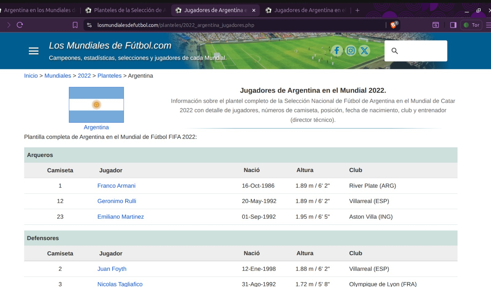

## Herramientas Utilizadas

### Navegadores Automatizados

- **Selenium WebDriver** con navegadores:
  - Firefox + GeckoDriver (máxima compatibilidad)
  - Chrome + ChromeDriver (velocidad y estabilidad)
  
### Estrategias Anti-Detección

- **User-Agents variados:** Rotación de navegadores (Chrome, Firefox, Safari, Edge)
- **Proxies dinámicos:** Listas de 50+ servidores rotativas para distribuir solicitudes
- **Tor Browser:** Conexiones anónimas cuando fue necesario
- **Delays inteligentes:** Pausas de 5-10 segundos entre solicitudes para simular comportamiento humano
- **Opciones Selenium:** Desactivación de banderas de automatización

```python
# Configuración anti-detección típica
options.add_argument('--disable-blink-features=AutomationControlled')
excludeSwitches = ["enable-automation"]
useAutomationExtension = False
```

Esto debido a que a lo largo del proyecto se enfrentaron a bloqueos por parte del sitio web, debido a la detección de actividad sospechosa (scraping), por lo que se implementaron estas estrategias para evitar ser bloqueados y poder obtener toda la información necesaria.

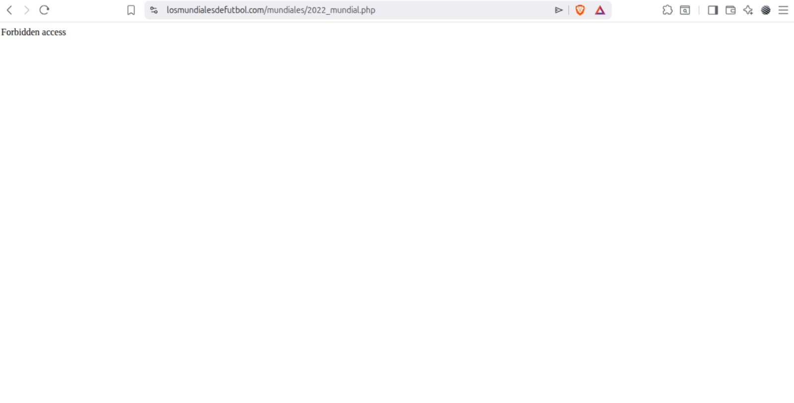

### Procesamiento HTML

- **BeautifulSoup4:** Parsing y extracción de datos de HTML
- **Regex (módulo `re`):** Extracción de patrones complejos de texto
- **Pandas:** Transformación y manipulación de datos en DataFrames

## Módulos de Extracción

| Módulo | Archivo Principal | Datos Extraídos |
|--------|-------------------|------------------|
| **Selecciones/Países** | `O_Selecciones.py` | ID país, nombre, bandera |
| **Mundiales** | `Mundiales.py` | Años, países organizadores, campeones |
| **Jugadores** | `Jugadores.py`, `O_html.py` | ID, referencia, nombre, posición, estadísticas |
| **Planteles** | `jugador_plantel.py` | Relaciones jugador-mundial-selección-grupo |
| **Partidos** | `scrapearDatos.py` | Goles, tarjetas, cambios, capitanes, no disponibles |
| **Premios** | `Premios.py` | Ganadores de premios por mundial y categoría |
| **Goles/Penales** | `datso_goles.py` | Goles, penales, minutos, autores |
| **Equipos Ideales** | `equipo_ideal.py` | Jugadores seleccionados, posición, mundial |

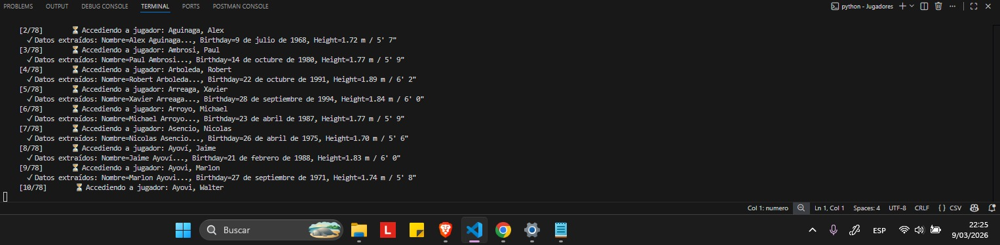

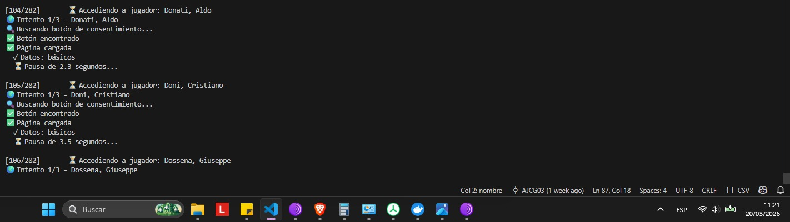


## Datos Extraídos

### Premios
- **Categorías:** Balón de Oro, Balón de Plata, Botín de Oro, Botín de Plata, Guante de Oro, Mejor Jugador Joven, FIFA Fair Play
- **Formato:** ID premio, ID mundial, ID jugador, tipo de premio
- **Archivo:** `premios.csv`

### Partidos y Eventos
- **Goles:** Minuto, jugador, tipo (gol normal o penal)
- **Tarjetas:** Roja/amarilla, minuto, jugador, motivo
- **Cambios:** Jugador que sale, jugador que entra, minuto
- **Jugadores Especiales:** Capitanes, no disponibles, titulares
- **Archivos:** `goles_desde_csv.csv`, `tarjetas_desde_csv.csv`, `cambios_desde_csv.csv`, `capitanes_desde_csv.csv`

### Jugadores y Planteles
- **Por jugador:** ID, referencia web, nombre, fecha nacimiento, altura
- **Por plantel:** Jugador, mundial, país, grupo, posición
- **Archivos:** `Jugador.csv`, `jugador_plantel.csv`, `Plantel.csv`

### Equipos Ideales
- **Estructura:** Jugador, posición (portero, defensor, mediocampista, delantero), mundial, ranking
- **Archivo:** `equipo_ideal.csv`

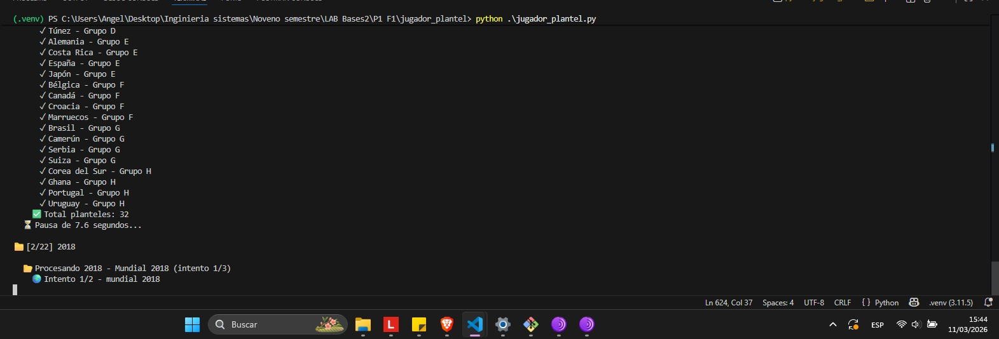

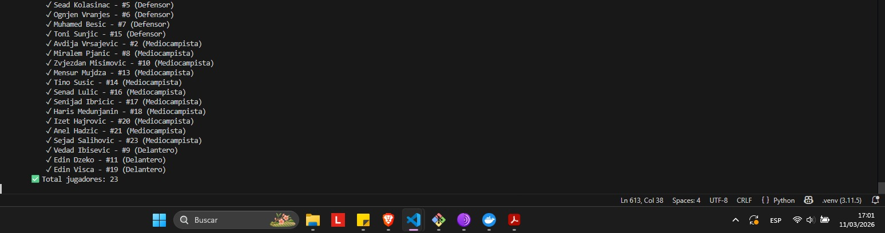

## Desafíos y Soluciones

| Problema | Solución |
|----------|----------|
| Sitio web con JavaScript dinámico | Uso de Selenium para rendering completo |
| Bloqueo por anti-bot (rate limiting) | Proxies, Tor, delays variables, user-agents rotativas |
| Referencias inconsistentes (espacios vs guiones) | Múltiples formatos de búsqueda |
| Caracteres HTML corruptos (codificaciones mixtas) | Prueba iterativa: UTF-8, latin-1, cp1252 |
| Tablas con estructura variable | Parsing flexible con BeautifulSoup |

---

# Parseo y Normalización con Python

Una vez extraídos los datos crudos del sitio web, fue necesario procesarlos para estructurarlos conforme al modelo relacional. Este proceso se realizó en Python mediante scripts `parse.py` específicos para cada entidad.

## Objetivo del Parseo

Transformar **datos heterogéneos y con referencias textuales** en un **modelo relacional con IDs numéricos**, garantizando:

- **Integridad referencial:** Cada referencia a otra entidad sea reemplazada por su ID
- **Consistencia:** Todas las variantes de un mismo nombre se unifiquen
- **Trazabilidad:** Mantener relaciones complejas entre entidades (mundial → país → jugador → eventos)

## Estructura del Parseo

Cada `parse.py` sigue un patrón general:

```
1. CARGA
   └─ CSV crudos (datos extraídos)
   └─ Archivos de referencia (Mundial.csv, Jugador.csv, Pais.csv, Plantel.csv)

2. NORMALIZACIÓN
   └─ Crear diccionarios de búsqueda
   └─ Manejar múltiples formatos de referencia
   └─ Resolver inconsistencias (tildes, espacios, guiones)

3. RELACIÓN (JOIN)
   └─ Mapear referencias textuales → IDs
   └─ Búsquedas compuestas (múltiples criterios)
   └─ Validar existencia de referencias

4. EXPORTACIÓN
   └─ CSV normalizado con IDs
   └─ Estructura lista para base de datos
```

## Módulos de Parseo

### `equipo_ideal/parse.py`

**Entrada:** `equipo_ideal.csv`, `Mundial.csv`, `Jugador.csv`

**Transformaciones:**
- Año (ej: `"2018"`) → `id_mundial` (ej: `1`)
- Referencia jugador (ej: `"lionel_messi.php"`) → `id_jugador` (ej: `15`)
- Posición normalizada

**Salida:** `equipo_ideal_normalizado.csv` con estructura:
```
id_mundial, id_jugador, posicion, ranking
```

### `Premios/parse.py`

**Entrada:** `premios.csv`, `Mundial.csv`, `Jugador.csv`, `pais.csv`

**Transformaciones (búsquedas en cascada):**
- Año → `id_mundial`
- Referencia jugador (múltiples formatos: nombre, referencia, variantes) → `id_jugador`
- Nombre país → `id_pais`
- Tipo premio → categoría normalizada

**Salida:** `premios_normalizado.csv` con estructura relacional

### `jugador_plantel/parse.py`

**Entrada:** `jugador_plantel.csv`, `Mundial.csv`, `Plantel.csv`, `Jugador.csv`

**Transformaciones (búsquedas multidimensionales):**
- Combinación (mundial, país, jugador) → IDs relacionados
- Búsquedas compuestas para resolver ambigüedades
- Validación de integridad

**Salida:** `jugador_plantel_normalizado.csv`

### Otros módulos

Similarmente, cada entidad tiene su `parse.py`:
- `Mundiales/parse.py` → Normalización de mundiales
- `Pais/parse.py` → Normalización de países
- `Partido/parse.py` → Normalización de partidos
- `Plantel/parse.py` → Normalización de planteles
- `Jugadores/parse.py` → Normalización de jugadores

## Estrategias de Búsqueda

### 1. Búsqueda Directa
```python
# Busca coincidencia exacta en diccionario
id = dict_jugadores.get(referencia)
```

### 2. Búsqueda Normalizada
```python
# Crea múltiples variantes de la referencia:
# "lionel_messi.php" → ["lionel_messi", "lionel messi", "messi"]
# Busca cada variante hasta encontrar coincidencia
```

### 3. Búsqueda Compuesta (Multidimensional)
```python
# Busca por múltiples criterios simultáneamente:
# (mundial=2018) AND (pais=Argentina) AND (nombre=Messi)
```

## Archivos de Referencia

Para el parseo se utilizan archivos maestros pre-normalizados:

| Archivo | Contenido | Uso |
|---------|----------|-----|
| `Mundial.csv` | ID mundial, año, país organizador, campeón | Mapeo año → ID mundial |
| `Jugador.csv` | ID jugador, referencia, nombre, fecha nacimiento | Mapeo referencia/nombre → ID jugador |
| `pais.csv` | ID país, nombre, bandera | Mapeo país → ID país |
| `Plantel.csv` | ID plantel, ID mundial, ID país, grupo | Contexto de planteles |
| `Partido.csv` | ID partido, ID mundial, país1, país2, fecha | Contexto de partidos |

## Salida: Tablas Normalizadas

Todos los archivos parseados se guardan en `Tablas_parceadas/` con estructura relacional:

```
Tablas_parceadas/
├── gol.csv
├── tarjetas.csv
├── cambios.csv
├── capitania.csv
├── no_disp.csv
├── equipo_ideal.csv
├── premios.csv
├── jugador_plantel.csv
├── Jugador.csv
├── Plantel.csv
├── Partido.csv
├── pais.csv
├── Mundial.csv
└── tipos_de_premio.csv
```

Cada archivo contiene solo IDs como claves externas, listo para ser importado a una base de datos relacional.

# Procesamiento y Normalización de Datos en Excel

Se describe el proceso de **limpieza, transformación y normalización de datos** realizado en Excel para estructurar información relacionada con partidos, jugadores, eventos y planteles.

El objetivo fue transformar **datos crudos (raw data)** en un **modelo estructurado tipo relacional**, similar a una base de datos.

Todos estos datos en crudos fueron derivados por los scrapers de Python en formato csv, y luego se trabajó en Excel para limpiarlos y relacionarlos.

### En este proyecto:

Se trabajó con datos que tenían problemas como:

- Nombres inconsistentes (`"México"` vs `"Mexico"`)
- Referencias distintas (`"karim_benzema.php"` vs `"karim benzema"`)
- Campos vacíos o incorrectos
- Datos duplicados o mal relacionados

Todo esto se resolvió mediante **fórmulas en Excel (principalmente `BUSCARX`)**

---

## Estructura del Modelo de Datos

Se trabajó con múltiples entidades:

- Partidos
- Jugadores
- Planteles
- Eventos (goles, tarjetas, cambios)
- Relaciones entre tablas

Esto simula un modelo tipo:

```sql
Partido ←→ Plantel ←→ Jugador
```

> Todo derivado de la estructura de datos obtenida por los scrapers y el modelo de la base de datos.

---

##  Obtención de IDs (Relaciones)

Uno de los principales retos fue **reemplazar texto por IDs**.

---

## Obtener `id_partido`

Se necesitaba mapear:

* `mundial`
* `pais1`
* `pais2`

Para obtener el `id_partido`.

### Fórmula usada:

```excel
=BUSCARX(1;(F2=J$2:J$1000)*(G2=K$2:K$1000)*(H2=L$2:L$1000);E$2:E$1000)
```

### Explicación:

* Se comparan múltiples condiciones
* Se multiplican → solo da `1` si todas coinciden
* `BUSCARX` encuentra esa fila y devuelve el ID

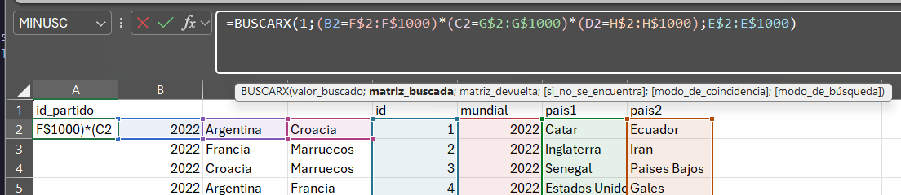

---

## Obtener `id_jugador`

Problema:

* A veces el jugador venía con:

  * referencia
  * nombre
* Y no siempre coincidían

### Solución:

```excel
=BUSCARX(D2;E$2:E$1000;F$2:F$1000)
```

### Lógica:

1. Buscar por referencia (más preciso)

Se remplazo a base de Excel "-" por un espacio en blanco " " e igual para "_" con un espacio en blanco " " y eliminar ".php" para igualar referencias con nombres.

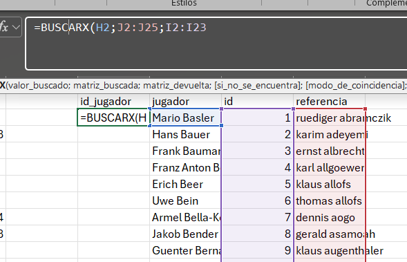

---

## Normalización de texto

Para evitar errores por tildes, espacios o símbolos:

```excel
=MINUSC(SUSTITUIR(SUSTITUIR(SUSTITUIR(SUSTITUIR(SUSTITUIR(A2;"á";"a");"é";"e");"í";"i");"ó";"o");"ú";"u"))
```

Esto permitió:

* Igualar `"Méndez"` con `"Mendez"`
* Igualar `"Götze"` con `"Gotze"`

Al igual para evitar errores por extranjeras se eliminan los caracteres con doble doble punto encima de su letra como "ö" o "ü" por su equivalente sin el doble punto como "o" o "u".

```excel
=MINUSC(SUSTITUIR(SUSTITUIR(A2;"ö";"o");"ü";"u"))
```

---

## Obtener `id_plantel`

Se utilizó el `id_jugador` como clave:

```excel
=BUSCARX(1;(H2=L$2:L$1000)*(I2=M$2:M$1000);K$2:K$1000)
```

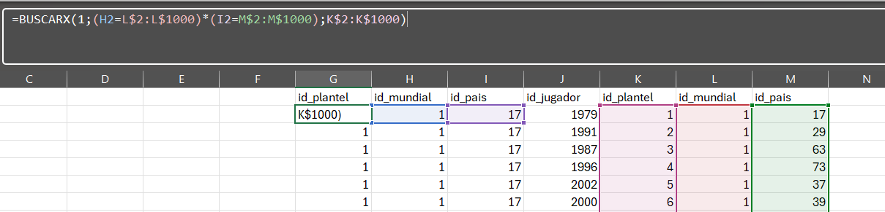

---

## Transformaciones realizadas

### Conversión de booleanos

```excel
=SI(valor="True";1;0)
```

---

### Eliminación de duplicados

* Usando `CONTAR.SI.CONJUNTO`
* O herramienta de Excel

---

### Filtrado de datos válidos

```excel
=FILTRAR(A2:B1000;A2:A1000<>"N/A")
```

---

### Ordenamiento lógico

Se priorizó:

1. `id_partido`
2. `id_mundial`
3. `id_plantel`
4. `id_jugador`
5. otros eventos

---

## Problemas encontrados

### Inconsistencias en nombres

* Diferentes formatos
* Tildes
* Guiones

### Datos faltantes

* Jugadores sin referencia
* Campos vacíos

### Encoding incorrecto

* `"Bélgica"` en lugar de `"Bélgica"`

---

## Soluciones aplicadas

* Normalización de texto
* Búsquedas en cascada
* Uso de múltiples criterios
* Limpieza manual + fórmulas

Donde se logró:

- Relacionar todas las tablas
- Generar IDs consistentes
- Limpiar datos inconsistentes
- Simular un modelo relacional en Excel

---

# Vistas Creadas en la DB

Una **vista** en bases de datos es esencialmente una tabla virtual cuyo contenido está definido por una consulta. A diferencia de una tabla real, una vista no almacena datos de forma permanente por sí misma, sino que ejecuta la consulta subyacente cada vez que es invocada. Esto permite encapsular lógicas complejas, múltiples cruces de tablas (uniones) y cálculos en un solo objeto que se consulta de forma directa. Las vistas en este proyecto se crearon con el objetivo de facilitar la extracción de información compleja, simplificando las consultas para el usuario final y evitando la repetición de código SQL extenso. A continuación, se detallan de manera explícita las 19 vistas implementadas:

## 1. common_info_mundial

Esta vista consolida la información general de cada edición del mundial y funciona realizando múltiples uniones entre las tablas principales del modelo. Emplea la tabla `mundial` como centro y la enlaza con la tabla `partido`, la tabla `pais` (para extraer tanto el país organizador como el país campeón a través de diferentes llaves foráneas), la tabla `plantel` y la tabla `gol`. Adicionalmente, agrupa los resultados usando funciones de agregación para calcular el recuento total de las selecciones participantes, la cantidad exacta de partidos jugados y los goles totales anotados. Se utiliza como un panel de control inicial para obtener un resumen rápido y completo a nivel histórico de las diversas ediciones del torneo, reduciendo la necesidad de contar manualmente en cada consulta.

```sql
SELECT * FROM common_info_mundial;
GO
```

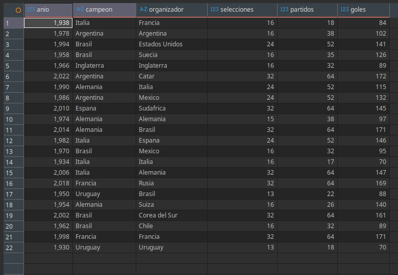

## 2. resumen_partido

Esta vista se encarga de estructurar y calcular los resultados finales definitivos de cada partido disputado en los torneos. Funciona integrando dos subconsultas o tablas temporales dentro de su estructura: una que extrae el total de goles anotados a través de la tabla `gol` y otra que cuantifica las anotaciones logradas en vía de penales usando la tabla `penales`. Posteriormente, se compara matemáticamente qué equipo sumó más puntos en todas las vías e identifica directamente el equipo ganador absoluto o si el resultado terminó en empate. Resulta clave en el proyecto porque los reportes de resultados se pueden generar automáticamente sin tener que recomputar la cantidad de anotaciones extraídas de las entidades de eventos.

```sql
SELECT * FROM resumen_partido;
GO
```

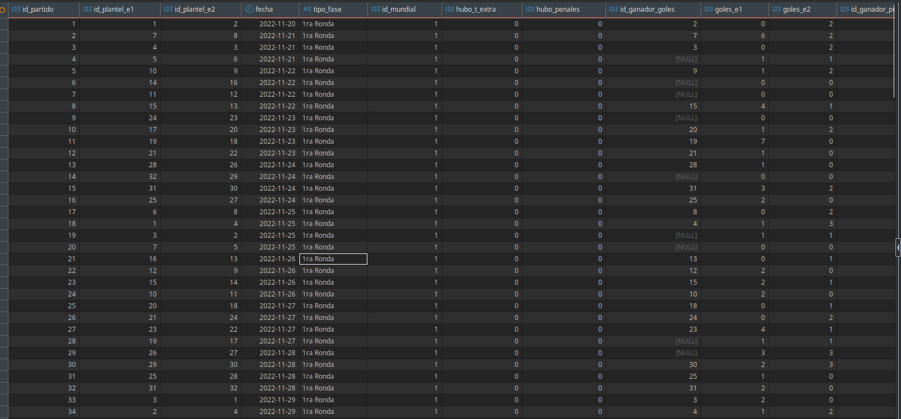

## 3. posiciones_finales

Esta vista está diseñada para generar la tabla de clasificación de rendimiento de los equipos que cerró cada torneo mundial. Su funcionamiento se basa en determinar la fase máxima a la que llegó cada equipo y priorizarlas para definir un ranking y calcular automáticamente diferentes estadísticas futbolísticas de la época, empleando la regla histórica que asignaba 2 puntos por victoria antes del mundial de 1994 y 3 puntos en las ediciones posteriores. Contabiliza el número total de partidos jugados, las victorias, los empates, las derrotas, los goles a favor obtenidos, los goles en contra recibidos y la diferencia final. El propósito de este objeto es que el usuario conozca la posición real de una selección, eliminando la ambigüedad que generarían los empates a puntos.

```sql
SELECT * FROM posiciones_finales;
GO
```

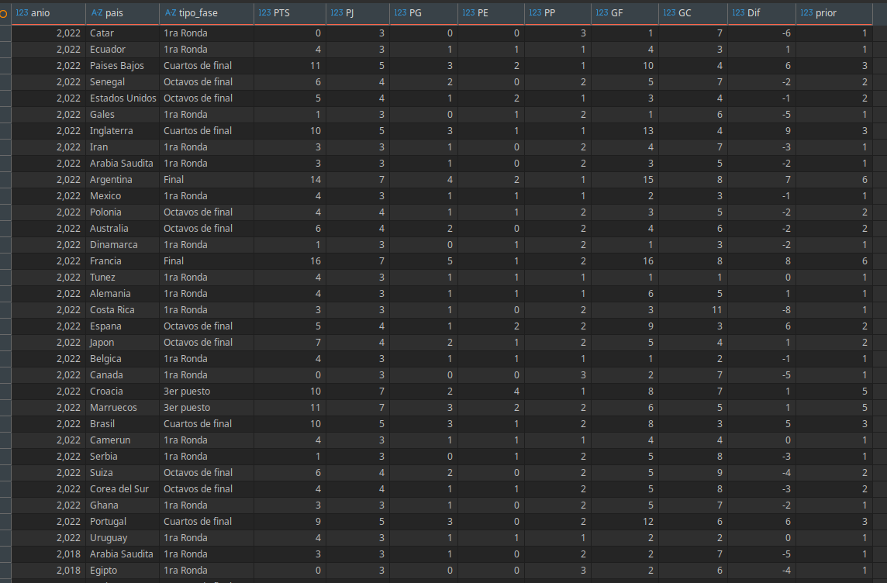

## 4. fase_final

Esta vista fue creada para mostrar las diferentes llaves de eliminatorias de los mundiales basándose exclusivamente en los partidos de muerte súbita (desde los octavos de final hasta la gran final). Su funcionamiento se activa filtrando a todos los partidos cuya etapa dentro de la base de datos sea diferente a "1ra Ronda" (lo cual excluye automáticamente la etapa de grupos). Además, concatena en un formato visual legible la cantidad de goles marcando los tantos anotados en tiempo de juego y, entre paréntesis, las anotaciones logradas a través de la tanda de penales si corresponde. Es ideal y se utiliza para visualizar toda la trayectoria o "bracket" de eliminatorias de un certamen de forma cronológica.

```sql
SELECT * FROM fase_final;
GO
```

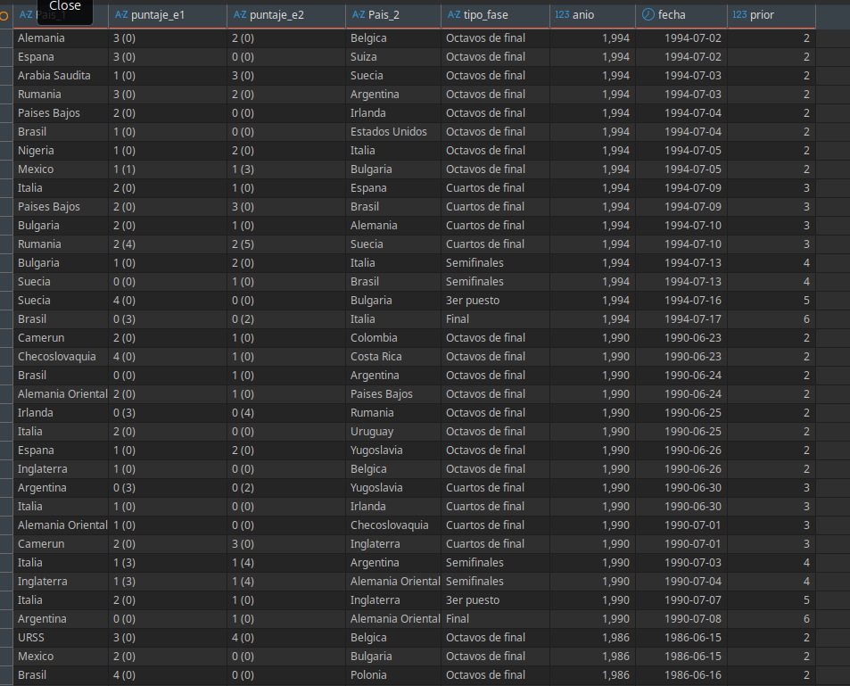

## 5. goleadores

Esta vista presenta el ranking histórico y estadístico de los jugadores con mayor número de goles en cada edición. Opera buscando los registros del jugador, sus planteles y los cruza directamente con la tabla `gol` para acumular una sumatoria de los tantos realizados. Del mismo modo, calcula el número exacto de partidos diferentes en los que el jugador ha participado, tomando en consideración tanto si fue titular como si ingresó en una sustitución, gracias a un conteo derivado. Finalmente cruza ambos datos para devolver el promedio matemático exacto de goles por partido del jugador. Es de gran ayuda cuando se busca encontrar de forma unificada a las máximas figuras ofensivas que ha tenido el mundo futbolístico.

```sql
SELECT * FROM goleadores;
GO
```

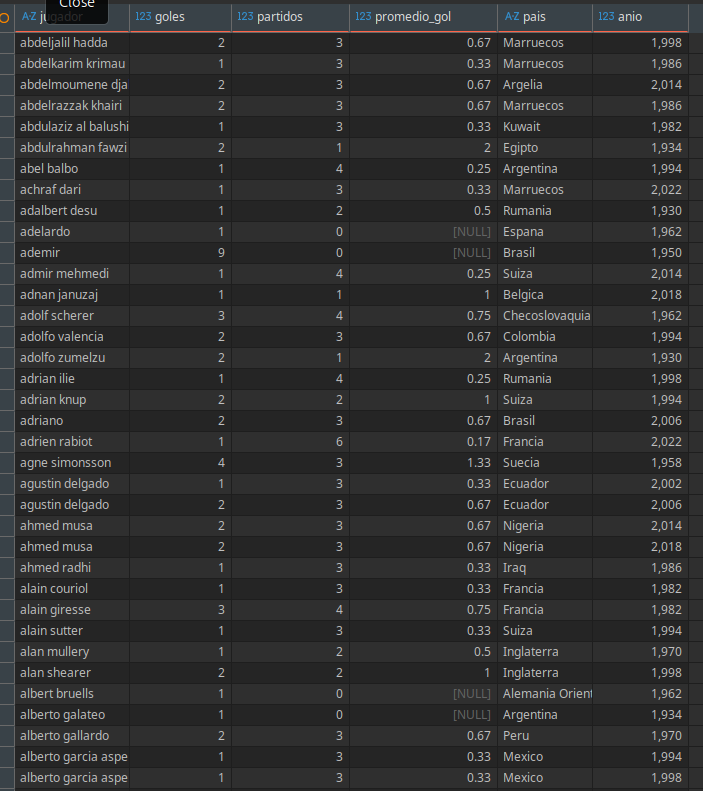

## 6. grupos_planteles

Esta vista recrea las tradicionales tablas de posiciones de la fase de grupos de cada mundial. Trabaja de manera muy similar a la vista de clasificación global, pero su código está estrictamente filtrado a realizar agrupaciones y sumatorias únicamente dentro de la fase denominada "1ra Ronda". Realiza un agrupamiento de la información tanto por el año de competición global como por la designación de la letra del grupo. Suma la distribución de partidos entre el plantel uno y el plantel dos para determinar de forma explícita partidos jugados, puntos y diferencia goleadora, ayudando a determinar directamente quiénes ganaron el pase hacia las rondas definitorias de cada edición.

```sql
SELECT * FROM grupos_planteles;
GO
```

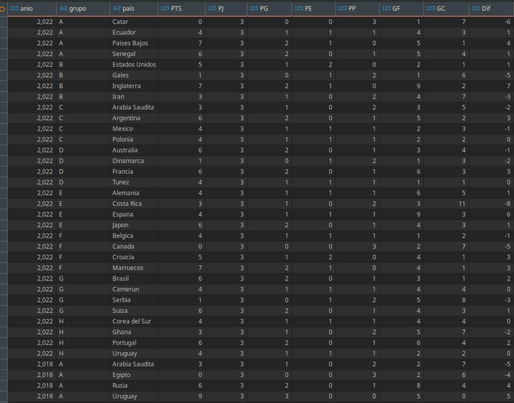

## 7. equipo_ideal_bonito

Esta vista organiza a los once futbolistas que fueron reconocidos como los más destacados en cada campeonato en conjunto. Recoge la información desde la relación `equipo_ideal` que une mundial y jugador, anexando el país mediante el mapeo del plantel en ese mismo torneo. Retorna toda la información textual necesaria e incluye un nivel de legibilidad al proveer explícitamente el nombre de la nación representada, el atleta y la posición táctica que se le asignó. El uso primordial radica en obtener los onces ideales seleccionados por la FIFA directamente organizados sin necesidad de lidiar por separado con el identificador abstracto del jugador o país.

```sql
SELECT * FROM equipo_ideal_bonito;
GO
```

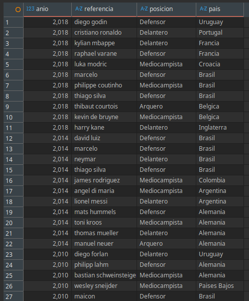

## 8. premios_bonito

Esta vista compila y da formato a las condecoraciones y máximos premios entregados a nivel de campeonatos. Funciona unificando información bajo la estructura funcional `UNION` de dos naturalezas distintas: la primera extrae los galardones orientados a nivel individual y une la información del tipo de premio con la figura del jugador galardonado y su respectiva nación; la segunda rama de la misma vista absorbe los premios enfocados netamente al plantel de una selección, en donde no hay jugadores abstractos identificados, sino premiaciones a equipos. Se utiliza para listar de forma estandarizada e integral el palmarés total y todos los reconocimientos oficiales surgidos al acabar los torneos.

```sql
SELECT * FROM premios_bonito;
GO
```

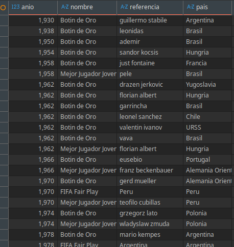

## 9. calendario

Esta vista proporciona completamente estructurada la programación y disposición cronológica bajo la cual ocurrieron los encuentros. Resulta de la vinculación simple pero metódica de la tabla partido, los planteles involucrados y los países, sin necesidad de calcular eventos como goles o infracciones. Su funcionamiento ordena los partidos en función de la fecha general, especificando la etapa del torneo por la que se cruzan y referenciando simultáneamente los nombres nominales de ambas naciones beligerantes. Su uso permite reconstruir con total claridad la línea de eventos exactos y entender bajo qué estructura de fechas se resolvió un mundial.

```sql
SELECT * FROM calendario;
GO
```

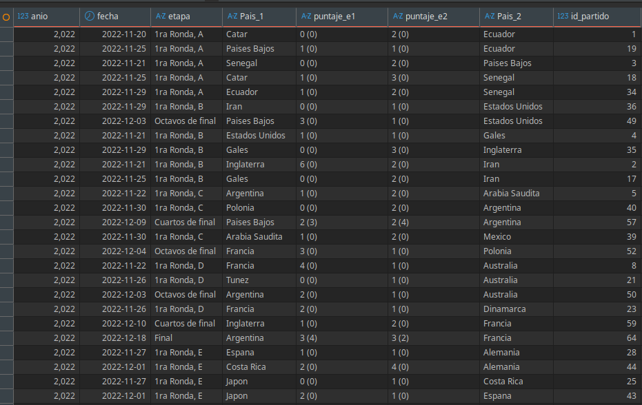

## 10. common_info_pais

Esta vista se diseñó para brindar un profundo perfil con el estatus histórico completo de cualquier país o selección. Su funcionamiento aísla todos los partidos en base a una nación sin importar las fechas o mundiales concretos para calcular subconsultas generalizadas que contabilizan cuántas participaciones han tenido en campeonatos mundiales, su volumen total de partidos tanto resueltos por victorias como fracasos y los goles producidos contra selecciones rivales. Paralelamente recupera un registro unificado si ese país alguna vez operó como el país anfitrión del campeonato. Funciona como principal carta de presentación para las estadísticas e idiosincrasia futbolísticas globales de cualquier estado.

```sql
SELECT * FROM common_info_pais;
GO
```

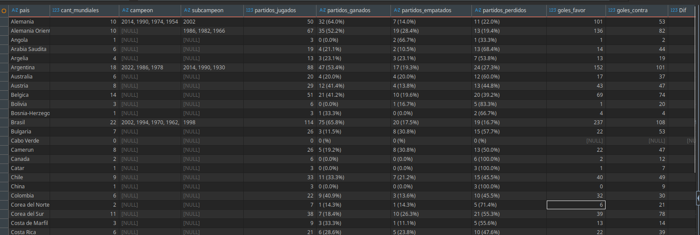

## 11. plantel_por_anio_pais

Esta vista funciona enfocándose en enumerar en su totalidad la plantilla acreditada que inscribió oficialmente un país para un torneo puntual del mundial. Desglosa los registros de los jugadores a través de la relación de múltiples niveles de bases de datos que engranan a la nación, al plantel general y las asignaciones específicas de los jugadores. Devuelve la lista en base a un formato legible incluyendo la estatura, número dorsal y características de la nómina correspondientes a ese año. El usuario final usa esto para analizar si algún jugador convocado integró la lista para el campeonato independientemente de que haya disputado minutos en campo de juego.

```sql
SELECT * FROM plantel_por_anio_pais;
GO
```

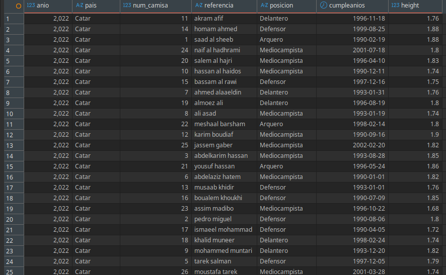

## 12. posiciones_mundiales_pais

Esta vista simplifica la recopilación estadística sobre el rendimiento histórico al listar la posición final lograda por un combinado nacional a través de absolutamente todas las copas que pudo experimentar. Funciona en paralelo o como derivado de la vista explicada de `posiciones_finales`, únicamente que centra su foco filtrando una trayectoria selecta y progresiva bajo el contexto nominal de un país específico por un transcurso cronológico y no orientada hacia el torneo como principal variable. Esto ayuda a monitorear la curva de rendimiento internacional que arrastra el país.

```sql
SELECT * FROM posiciones_mundiales_pais;
GO
```

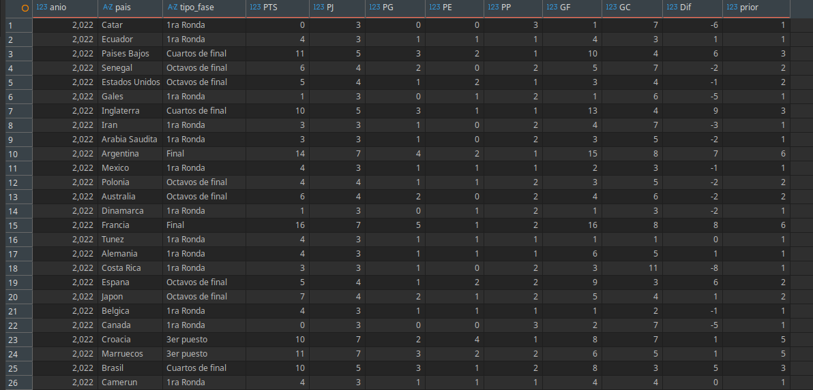

## 13. goleadores_pais

Esta vista orienta las facultades ofensivas enfocándose únicamente en agrupar de forma interna y sumar las cifras pertenecientes a cada exponente goleador a nivel de federación local. Toma al individuo, une y correlaciona todos los partidos a lo largo de su carrera que haya jugado frente a equipos adversarios junto con el total de sus anotaciones a nombre del mismo plantel, contabilizando implícitamente a cuántas competiciones distintas del mundial ha asistido a modo de experiencia. Su uso es esencial para destacar las leyendas históricas que componen su selección a través de todas y cada una de sus convocatorias para la competición.

```sql
SELECT * FROM goleadores_pais;
GO
```

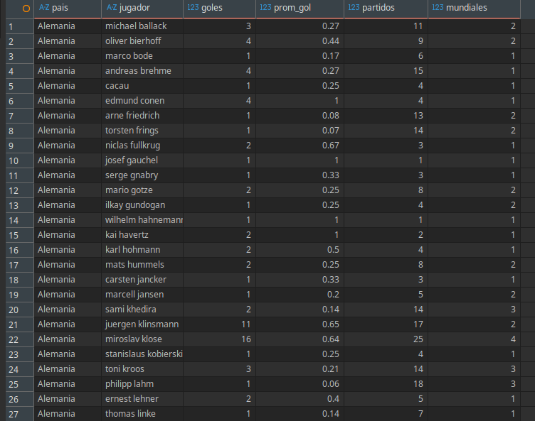

## 14. cambios_bonito

Esta vista modela toda la logística sucedida a causa de transiciones deportivas en la cancha dando nombre visual a cada individuo envuelto en una sustitución de los equipos. Trabaja enlazando el evento almacenado por la tabla `cambio` utilizando un doble uso visualizado de la identidad del jugador (una alias para quien abandona el campo de juego y otra alias para quien ingresa). Expone detalladamente el equipo que consuma la táctica, los dos sujetos protagonistas y determina visualmente en qué instante transcurría el juego. Da un apoyo descriptivo gigante al analizar cómo han funcionado las estrategias en cancha tras el silbato de inicio.

```sql
SELECT * FROM cambios_bonito;
GO
```

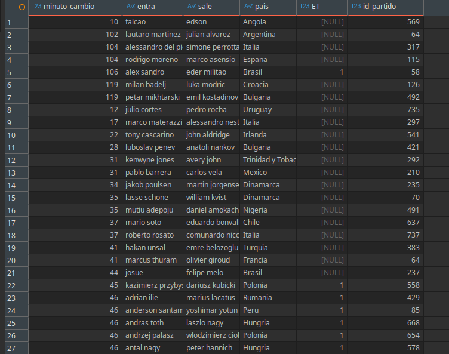

## 15. tarjetas_bonito

Esta vista organiza explícitamente los diferentes comportamientos e infracciones reglamentarias y disciplinarias que resultan de los encuentros en base a cada partido. Vincula todos los hechos de las tarjetas registradas agrupando el nombre natural del árbitro sancionador mediante la tabla del evento y exponiendo al infractor en sí. El sistema especifica nominalmente el minuto del incidente, detalla tajantemente la nacionalidad vinculada a la sanción y revela si el acto penalizado corresponde al nivel reglamentario de una amonestación u ameritaba una descalificación permanente (tarjeta roja), aportando las bases para registros éticos de partidos.

```sql
SELECT * FROM tarjetas_bonito;
GO
```

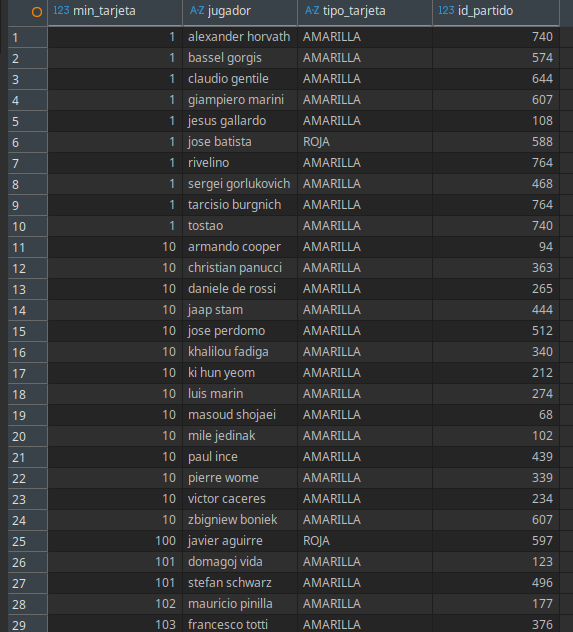

## 16. jugadores_partido

Esta vista sirve como el escáner más integral posible sobre los involucrados que se presentaron durante una cita o cruce en un estadio. La estructura tiene un diseño bastante robusto, ya que empalma información mediante un `UNION` general en el cual convergen los atletas que abrieron como los titulares, el conjunto de suplentes que obtuvieron su ingreso desde banca, los inhabilitados para jugar e incluso quienes conformaban el banco que no pudieron jugar pero permanecían en observación táctica en partido. Se utiliza fuertemente para determinar qué grado de estatus disponían las nóminas competidoras para ese choque exclusivo de eliminatoria y designar quién gozaba el título de capitán general en el terreno de juego.

```sql
SELECT * FROM jugadores_partido;
GO
```

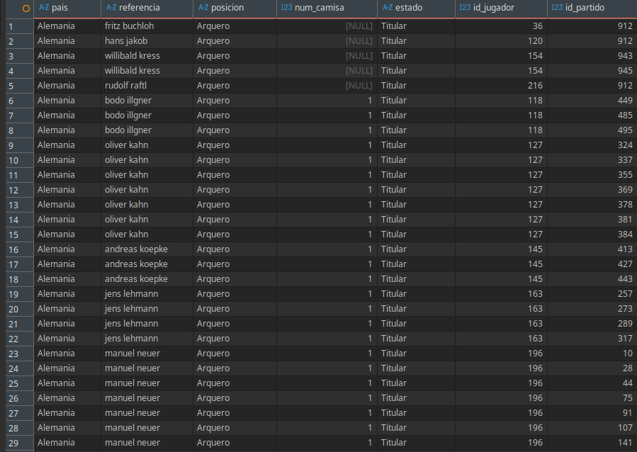

## 17. goles_partido

Esta vista proporciona minuto a minuto bajo un formato descendente la narrativa explícita y precisa de la producción goleadora conseguida estrictamente por partido global y particular. Integra el conteo y la temporalidad del campo que cruza al anotador de un bando ante su contrario y provee visualmente la indicación de en qué estadio cronológico del pleito estalló la anotación en terreno de juego. Esta vista soluciona de forma inmediata y permite reconstruir fielmente con el puro espectro temporal cómo sucedió el combate para observar si el ganador alcanzó un gol al inicio y defendió el resultado o si dominaron un duelo remontando tras verse avasallados de principio a fin.

```sql
SELECT * FROM goles_partido;
GO
```

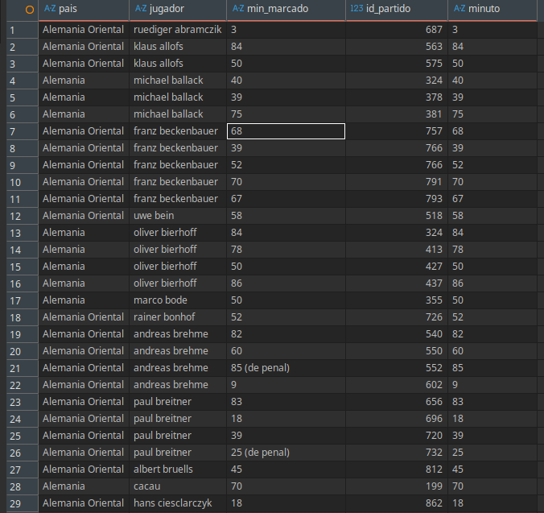

## 18. penales_partido

Esta vista extrae explícitamente todos los disparos generados en medio de la gran definición del punto penal de cobro. Toma su nombre a raíz de estructurar un bloque centrado que vincula al torneo, a los tiradores seleccionables y las derivaciones de eficacia de las rondas de pena máxima para identificar de manera específica qué jugador, por parte de qué selección y a favor de qué contienda fue registrado pateando en las loterías definitorias mostrando la consecuencia binaria explícita de si lo incrustó en la red rival o padeció un rechazo de su remate en un empate global de marcador en el fútbol.

```sql
SELECT * FROM penales_partido;
GO
```

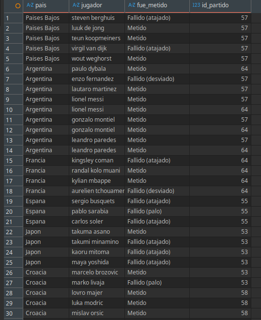

## 19. Conteos

Esta vista funciona estrictamente como una estructura administrativa o de monitoreo, brindando resúmenes generales absolutos a partir del agrupamiento masivo dentro de sus diversas agrupaciones lógicas de base. Utiliza construcciones encadenadas de selecciones múltiples unidas por un `UNION ALL` en la base relacional, apegadas con fórmulas abstractas de la función de cuenta simple que engloban todos los elementos o las tablas existentes, listando los rangos masivos del volumen total de futbolistas existentes, las selecciones conformadas documentadas en base de registros para que al final se compruebe el porcentaje integral extraído sobre las distintas sedes informáticas del globo terráqueo.

```sql
SELECT * FROM Conteos;
GO
```

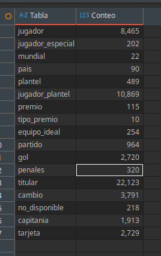

---

# Store Procedures Creados en la DB

Un **Store Procedure** (o Procedimiento Almacenado) es un conjunto de instrucciones y sentencias de código SQL precompiladas que se guardan directamente dentro de la base de datos para ser llamadas o ejecutadas de forma repetida. A diferencia de las vistas (que se centran solo en consultar datos estáticos o virtuales), los procedimientos almacenados incorporan lógica de programación, permitiendo el uso de bloques condicionales (como IF y ELSE), aceptando múltiples variables y sirviendo diferentes tablas de información basada en los mismos. Esto optimiza en gran medida la manera en que un usuario se comunica con la información, agrupando varias consultas en una sola herramienta adaptable. A continuación, se explican los tres parámetros construidos:

## 1. sp_info_mundial

Este procedimiento almacenado funciona como un robusto menú dinámico para visualizar las estadísticas enfocadas y contenidas en cualquier edición general del mundial. Se ejecuta con base en el año exacto de la competición que se desea consultar. Toma como variables de entrada el propio número correspondiente al año temporal, un descriptor funcional llamado "tipo de información" en el que se especifica en valor textual qué segmento histórico o tabla de resultados ('fase final', 'goleadores', 'premios') precisa generar el usuario, así como elementos y opciones más específicos orientados al nombre puntual de las selecciones si desea enfocar una búsqueda más íntima dentro del abanico temporal del torneo elegido. Si el descriptor llega a llamarse 'all', este procedimiento obvia las barreras lógicas de cada reporte y compila encadenadas de golpe cada bloque sobre el año brindado con absoluta integridad de visualización.

```sql
sp_info_mundial @anio = 2018, @tipo_informacion ='goleadores', @pais = 'Argentina'
GO
```

La informacion mostrada sera:
- common info
- posiciones finales
- fase final
- goleadores
- grupos y planteles
- calendario
- premios
- equipo ideal

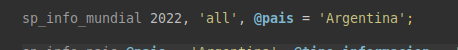

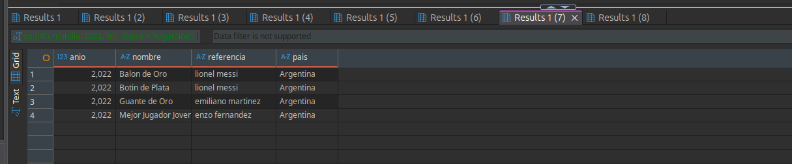

## 2. sp_info_pais

Esta herramienta se encuentra orientada a ofrecer expedientes profundos estructurando toda la trayectoria vinculada y específica hacia solo un país delimitado en su búsqueda. Requiere obligatoriamente que uno ingrese el nombre del territorio, la rama descriptiva de reportes a recuperar (por ejemplo 'planteles', 'goleadores' por el país dado o listado detallado de todas las ubicaciones correspondientes entre torneos). Acepta y es influido además por las variables vinculadas al jugador que permitirán al final extraer o centrar el perfil biográfico al listarlo, así como invocar todo parámetro cronológico a través del año particular de manera optativa al filtro visual. Ejecutando la orden general, compilará históricamente a todos aquellos atletas estelares o participaciones de fase nacional del usuario objetivo a la hora de explorar la herramienta solicitada a la base de información.

```sql
sp_info_pais @pais = 'Argentina', @tipo_informacion = 'planteles', @jugador = 'Lionel Messi', @anio = 2018
GO
```

La información mostrada será:
- common info
- planteles
- mundial por mundial
- resultados
- goleadores

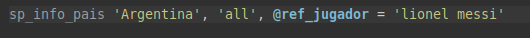

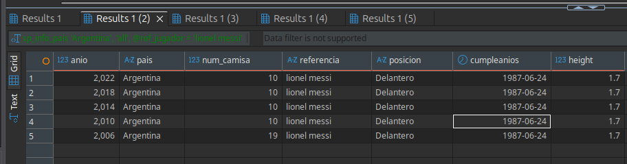

## 3. sp_info_partido

Este flujo está estructurado como una lupa enfocada de manera íntima en los eventos suscitados sobre encuentros precisos jugados sobre la zona del campo durante las horas del pitazo final. Solamente necesita asimilar el número identificador particular o la llave primaria del cruzamiento exacto de los países entre sus contricantes así como la palabra referente a las acciones del evento precisas (goles, modificaciones relativas como cambios de posición sustituidos, desgloses precisos con las infracciones sancionadoras y resultados de tarjetas de los penales emitidos sobre sus escuadras o el conteo de la asistencia en plantel). Este segmento particular no tiene múltiples variables compuestas cruzadas ya que atiende únicamente resultados en un nivel micro y específico de cada juego ejecutado arrojando si se determina, todos los incidentes compilados minuto a minuto generados a nivel competitivo en su fase o registro cronológico unificado totalizando sus informes en simultáneo de forma integral en visuales paralelos tras un llamado integral.

Para usarse solo se pasa que partido y qué tipo de información se quiere obtener:

```sql
sp_info_partido @id_partido = 1, @tipo_informacion = 'goles'
GO
```

La información que puede mostrarse será:
- all
- goles
- penales
- jugadores
- tarjetas
- cambios


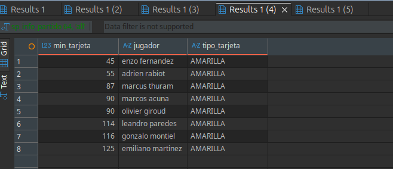

---

# Conclusiones

## Resumen del Proyecto

Este proyecto demostró la **integración exitosa de múltiples tecnologías** para construir una base de datos completa y consistente sobre mundiales de fútbol:

### Logros Principales

1. **Extracción robusta:** Se desarrolló un sistema de web scraping con múltiples estrategias anti-detección, permitiendo la obtención integral de datos desde `losmundialesdefutbol.com`.

2. **Transformación efectiva:** A través de Python y Excel, se normalizaron datos heterogéneos con inconsistencias de formato, codificación y referencias cruzadas.

3. **Modelo relacional completo:** Se diseñó y refinó un modelo lógico de base de datos que:
   - Captura todas las entidades relevantes (mundiales, países, jugadores, partidos, eventos, premios)
   - Mantiene integridad referencial mediante relaciones apropiadas
   - Permite consultas complejas sobre datos históricos
   - Identifica relaciones especiales (ej: relación identificadora en `No_disponible`)

4. **Documentación exhaustiva:** Se registraron todos los cambios realizados al diseño lógico con sus justificaciones.

### Tecnologías Utilizadas

- **Web Scraping:** Selenium WebDriver, BeautifulSoup4, Proxies, Tor
- **Procesamiento Python:** Pandas, Regex, CSV, Threading
- **Normalización de Datos:** Excel, BUSCARX, Fórmulas avanzadas
- **Base de Datos:** Modelo relacional, normalización

### Desafíos Resueltos

1. **Anti-bot detection:** Implementación de múltiples capas de anonimato (proxies, Tor, user-agents, delays)
2. **Inconsistencias de datos:** Normalización de referencias, tildes, espacios y caracteres especiales
3. **Relaciones complejas:** Búsquedas multidimensionales para mapear referencias textuales a IDs
4. **Codificaciones mixtas:** Manejo de UTF-8, Latin-1 y CP1252 en un mismo proyecto
5. **Datos incompletos:** Tratamiento de casos excepcionales (equipos sin grupo, jugadores sin referencia)

### Aplicaciones y Perspectivas

Esta base de datos puede ser utilizada para:

- **Análisis histórico:** Tendencias en mundiales, desempeño de selecciones
- **Estadísticas de jugadores:** Comparativas, premios, evolución historica
- **Investigación:** Patrones en resultados, equipos ideales, distribución de premios
- **Extensiones futuras:** Predicciones, visualizaciones interactivas, integración con APIs de fútbol moderno

### Recomendaciones Futuras

1. Implementar la base de datos en un DBMS (PostgreSQL, MySQL) con índices y optimizaciones
2. Desarrollar interfaces de consulta (SQL, REST API)
3. Automatizar actualizaciones cuando se disponga de nuevos mundiales
4. Agregar validaciones en tiempo real y auditoría de cambios
5. Crear visualizaciones y dashboards analíticos

---