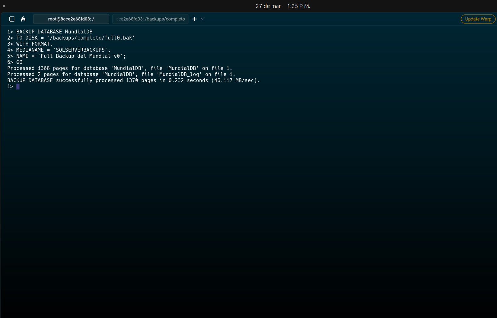
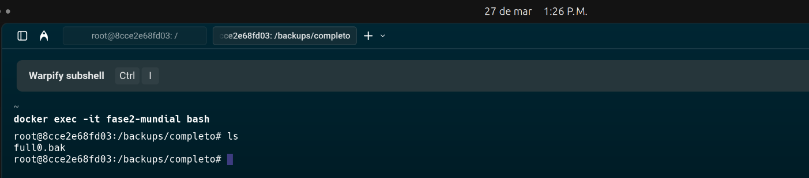
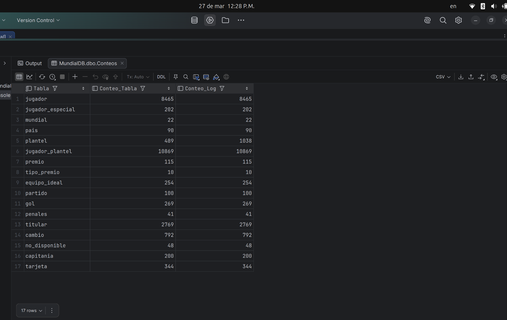

# Documentación Técnica del Proyecto
## Respaldo y Restauración de Bases de Datos

**Universidad San Carlos de Guatemala - Facultad de Ingeniería**  
**Ingeniería en Ciencias y Sistemas - Sistemas de Bases de Datos 2**

---

## Tabla de Contenido

1. [Resumen Ejecutivo](#1-resumen-ejecutivo)
2. [Metodología](#2-metodología)
3. [Modelo Entidad-Relación](#3-modelo-entidad-relación)
4. [Especificaciones Técnicas del Servidor](#4-especificaciones-técnicas-del-servidor)
5. [Implementación de Respaldo](#5-implementación-de-respaldo)
6. [Resultados de Restauración](#6-resultados-de-restauración)
7. [Análisis Comparativo](#7-análisis-comparativo)
8. [Conclusiones y Recomendaciones](#8-conclusiones-y-recomendaciones)
9. [Manual de Usuario](#9-manual-de-usuario)

---

## 1. Resumen 

El presente proyecto tiene como objetivo implementar una estrategia robusta de respaldo y restauración para la base de datos **MundialDB**, correspondiente a la fase previa del proyecto. Se trabajó con el motor **Microsoft SQL Server 2022** en entorno Docker, ejecutando todos los comandos desde línea de comandos (bash dentro del contenedor) sin utilizar herramientas visuales.

Se realizaron tres días consecutivos de carga de datos, al final de cada uno se ejecutaron:
- **Full Backup** (respaldo completo)
- **Differential Backup** (respaldo diferencial)

Posteriormente, se realizaron pruebas de restauración midiendo tiempos de ejecución para ambas estrategias, permitiendo un análisis comparativo objetivo sobre su rendimiento.

---

## 2. Metodología

El proyecto se desarrolló siguiendo las siguientes fases:

### Fase 1: Preparación y Diseño
- Configuración del entorno Docker con SQL Server 2022
- Creación de volúmenes para almacenamiento de backups (`/backups/completo/`, `/backups/diferencial/`)
- Diseño del esquema de base de datos normalizado con sus respectivas tablas de log

### Fase 2: Carga de Datos (Días 1-3)

| Día | Actividad | Validación |
|-----|-----------|------------|
| **Día 1** | Carga de datos inicial desde CSV | Capturas SELECT * y COUNT(*) |
| **Día 2** | Segunda carga incremental de datos | Capturas SELECT * y COUNT(*) |
| **Día 3** | Actualización de nombres a MAYÚSCULAS | Capturas de verificación |

Al final de cada día:
1. Full Backup
2. Differential Backup
3. Capturas de validación

### Fase 3: Restauración Full Backups
- Eliminación de la base de datos
- Restauración secuencial de full0, full1, full2
- Registro de tiempos y validación con capturas

### Fase 4: Restauración Differential Backups
- Eliminación de la base de datos
- Restauración secuencial de diff1, diff2, diff3
- Registro de tiempos y validación con capturas

### Fase 5: Análisis y Conclusiones
- Comparación de tiempos de restauración
- Análisis de ventajas y desventajas
- Recomendaciones basadas en resultados

---

## 3. Modelo Entidad-Relación

El esquema de la base de datos **MundialDB** consta de las siguientes tablas principales:

### Tablas Principales
- **pais** - Información de países participantes
- **jugador** - Datos de jugadores
- **partido** - Registro de partidos
- **capitania** - Capitanes por partido
- **no_disponible** - Jugadores no disponibles
- **cambio** - Sustituciones realizadas
- **titular** - Jugadores titulares por partido
- **tarjeta** - Tarjetas mostradas
- **gol** - Goles anotados
- **penales** - Lanzamientos de penales

### Tablas de Log (Requerimiento obligatorio)
- **LOG_Partido**
- **LOG_Pais**
- **LOG_Jugador**
- **LOG_Capitania**
- **LOG_NoDisponible**
- **LOG_Cambio**
- **LOG_Titular**
- **LOG_Tarjeta**
- **LOG_Gol**
- **LOG_Penales**


---

## 4. Especificaciones Técnicas del Servidor

### Configuración del Entorno

| Componente | Especificación |
|------------|----------------|
| **Motor DB** | Microsoft SQL Server 2022 (Developer Edition) |
| **Contenedor** | Docker |
| **Imagen** | mcr.microsoft.com/mssql/server:2022-latest |
| **Puerto** | 1434:1433 |
| **Autenticación** | SQL Server Authentication (sa) |

### Configuración Docker Compose

```yaml
services:
  db:
    image: mcr.microsoft.com/mssql/server:2022-latest
    container_name: fase2-mundial-backup
    user: root
    ports:
      - "1434:1433"
    environment:
      - ACCEPT_EULA=Y
      - MSSQL_SA_PASSWORD=Mundial.123
      - MSSQL_PID=Developer
    volumes:
      - ./completo:/backups/completo/
      - ./diferencial:/backups/diferencial/
```

### Estructura de Directorios

```text
proyecto/
├── completo/           # Full backups almacenados
│   ├── full0.bak
│   ├── full1.bak
│   └── full2.bak
├── diferencial/        # Differential backups almacenados
│   ├── diff1.bak
│   ├── diff2.bak
│   └── diff3.bak
├── capturas/           # Evidencias del proceso
│   ├── Backup/
│   │   ├── completo/
│   │   │   ├── full0_restauracion.png
│   │   │   ├── full1_restauracion.png
│   │   │   └── full2_restauracion.png
│   │   └── diferencial/
│   │       ├── diff1_restauracion.png
│   │       ├── diff2_restauracion.png
│   │       └── diff3_restauracion.png
│   └── Carga de datos/
│       ├── Dia 1/
│       │   ├── conteo/
│       │   ├── logs/
│       │   └── tablas_normal/
│       ├── Dia 2/
│       │   ├── conteo/
│       │   ├── logs/
│       │   └── tablas_normal/
│       └── Dia 3/
│           ├── conteo/
│           ├── logs/
│           └── tablas_normal/
└── scripts/
    ├── backup.sh
    ├── recovery.sh
    └── manualData.sql
```

---

## 5. Implementación de Respaldo

### Comandos de Backup Utilizados

#### Full Backup
```sql
BACKUP DATABASE MundialDB
TO DISK = '/backups/completo/full0.bak'
WITH FORMAT, 
     MEDIANAME = 'SQLServerBackups', 
     NAME = 'Full Backup del Mundial v0';
```

#### Differential Backup
```sql
BACKUP DATABASE MundialDB
TO DISK = '/backups/diferencial/diff1.bak'
WITH DIFFERENTIAL,
     NAME = 'Diferencial del Mundial v1';
```

### Script de Respaldo Automatizado (`backup.sh`)

```bash
docker exec -it fase2-mundial bash
/opt/mssql-tools18/bin/sqlcmd -S localhost -U sa -P Mundial.123 -C

# Verificar bases de datos
SELECT name FROM sys.databases;
GO

USE MundialDB;
GO

# Full Backup
BACKUP DATABASE MundialDB
TO DISK = '/backups/completo/full0.bak'
WITH FORMAT, MEDIANAME = 'SQLServerBackups', NAME = 'Full Backup del Mundial v0';
GO

# Differential Backup
BACKUP DATABASE MundialDB
TO DISK = '/backups/diferencial/diff1.bak'
WITH DIFFERENTIAL, NAME = 'Diferencial del Mundial v1';
GO
```

### Script de Restauración (`recovery.sh`)

```bash
docker exec -it fase2-mundial-backup bash
/opt/mssql-tools18/bin/sqlcmd -S localhost -U sa -P Mundial.123 -C

CREATE DATABASE MundialDB;
GO

# Restaurar Full Backup
RESTORE DATABASE MundialDB
FROM DISK = '/backups/completo/full0.bak'
WITH RECOVERY, REPLACE;
GO

# Restaurar Differential Backup (requiere full base con NORECOVERY)
RESTORE DATABASE MundialDB
FROM DISK = '/backups/completo/full0.bak'
WITH NORECOVERY, REPLACE;
GO

RESTORE DATABASE MundialDB
FROM DISK = '/backups/diferencial/diff1.bak'
WITH RECOVERY;
GO
```

---

## 6. Resultados de Restauración

### 6.1 Restauración - Estrategia Full Backup

| Backup | Tamaño (aprox.) | Tiempo Restauración | Estado | Validación |
|--------|-----------------|---------------------|--------|------------|
| full1.bak | ~12.6 MB (1610 páginas) | 0.227 segundos | Exitosa |  COUNTs coinciden |
| full2.bak | ~14.1 MB (1810 páginas) | 0.259 segundos | Exitosa |  COUNTs coinciden |
| full3.bak | ~14.5 MB (1858 páginas) | 0.213 segundos | Exitosa |  COUNTs coinciden |

*Cálculo de tamaño: 1 página = 8 KB*
- *full1.bak: 1610 × 8 KB = 12,880 KB ≈ 12.6 MB*
- *full2.bak: 1810 × 8 KB = 14,480 KB ≈ 14.1 MB*
- *full3.bak: 1858 × 8 KB = 14,864 KB ≈ 14.5 MB*

**Backups Completo 1**


**Backups Completo 2**


**Backups Completo 3**


### 6.2 Restauración - Estrategia Differential Backup

| Backup | Dependencia | Tiempo Restauración Total | Desglose | Estado | Validación |
|--------|-------------|---------------------------|----------|--------|------------|
| diff1.bak | full0.bak | 0.215 segundos | full0: 0.182 seg + diff1: 0.033 seg | Exitosa |  COUNTs coinciden |
| diff2.bak | full0.bak + diff1 | 0.231 segundos | full0: 0.197 seg + diff2: 0.034 seg | Exitosa |  COUNTs coinciden |
| diff3.bak | full0.bak + diff2 | 0.243 segundos | full0: 0.208 seg + diff3: 0.035 seg | Exitosa |  COUNTs coinciden 


**Backups diferencial 1**


**Backups diferencial 2**


**Backups diferencial 3**


**Full**


### 6.3 Validación de Integridad Post-Restauración

Para cada restauración se validó que los conteos de registros coincidieran con los datos originales:

```sql
-- Verificar conteo de registros por tabla
SELECT 'pais' as tabla, COUNT(*) as registros FROM pais
UNION ALL
SELECT 'jugador', COUNT(*) FROM jugador
UNION ALL
SELECT 'partido', COUNT(*) FROM partido
UNION ALL
SELECT 'gol', COUNT(*) FROM gol
UNION ALL
SELECT 'tarjeta', COUNT(*) FROM tarjeta
UNION ALL
SELECT 'cambio', COUNT(*) FROM cambio
UNION ALL
SELECT 'titular', COUNT(*) FROM titular
UNION ALL
SELECT 'capitania', COUNT(*) FROM capitania
UNION ALL
SELECT 'no_disponible', COUNT(*) FROM no_disponible
UNION ALL
SELECT 'penales', COUNT(*) FROM penales;
```

#### Resultados de Validación

| Restauración | Tablas Validadas | Resultado | Conteo Registrado | 
|--------------|------------------|-----------|-------------------|
| full0.bak (Día 0) | Todas las tablas |  Coinciden | 108 partidos, 269 goles 
| full1.bak / diff1.bak (Día 1) | Todas las tablas |  Coinciden | 532 partidos, 1352 goles 
| full2.bak / diff2.bak (Día 2) | Todas las tablas |  Coinciden | 964 partidos, 2720 goles 
| full3.bak / diff3.bak (Día 3) | Todas las tablas |  Coinciden | 964 partidos, 2720 goles  
#### Conteos Registrados por Día

| Tabla | Día 0 (full0) | Día 1 (full1/diff1) | Día 2 (full2/diff2) | Día 3 (full3/diff3) |
|-------|---------------|---------------------|---------------------|---------------------|
| jugador | 8465 | 8465 | 8465 | 8465 |
| jugador_especial | 202 | 202 | 202 | 202 |
| mundial | 22 | 22 | 22 | 22 |
| pais | 98 | 90 | 90 | 90 |
| plantel | 489 | 489 | 489 | 489 |
| jugador_plantel | 10869 | 10869 | 10869 | 10869 |
| premio | 115 | 115 | 115 | 115 |
| tipo_premio | 10 | 10 | 10 | 10 |
| equipo_ideal | 254 | 254 | 254 | 254 |
| **partido** | **108** | **532** | **964** | **964** |
| **gol** | **269** | **1352** | **2720** | **2720** |
| **penales** | **41** | **243** | **320** | **320** |
| **titular** | **2769** | **13608** | **22123** | **22123** |
| **cambio** | **792** | **3051** | **3791** | **3791** |
| **no_disponible** | **48** | **217** | **218** | **218** |
| **capitania** | **200** | **1062** | **1913** | **1913** |
| **tarjeta** | **344** | **2166** | **2729** | **2729** |

#### Observaciones de Conteos

| Día | Descripción | Cambios Relevantes |
|-----|-------------|-------------------|
| **Día 0** | Carga inicial | 108 partidos, 269 goles |
| **Día 1** | Segunda carga masiva | +424 partidos, +1083 goles, +487 goles por partido |
| **Día 2** | Tercera carga masiva | +432 partidos, +1368 goles, +432 goles por partido |
| **Día 3** | Actualización a MAYÚSCULAS | Conteos sin cambios, solo modificación de datos |

*Nota: La tabla `plantel` muestra diferencia entre Conteo_Tabla (489) y Conteo_Log (1038) debido a que los logs registran cada operación DML realizada sobre la tabla.*

**Dia0**

**Dia1**

**Dia2**

**Dia3**


## 7. Análisis Comparativo

### Tabla Comparativa de Tiempos de Restauración

| Día | Full Backup | Differential Backup | Diferencia |
|-----|-------------|---------------------|------------|
| Día 1 (full0.bak / diff1.bak) | 0.232 seg | 0.215 seg | -0.017 seg |
| Día 2 (full1.bak / diff2.bak) | 0.227 seg | 0.231 seg | +0.004 seg |
| Día 3 (full2.bak / diff3.bak) | 0.259 seg | 0.243 seg | -0.016 seg |
| **Promedio** | **0.233 seg** | **0.230 seg** | **-0.003 seg** |

*Nota: Los tiempos de restauración diferencial incluyen la restauración del full base (full0.bak) más el diferencial correspondiente.*

### Tabla Comparativa de Tiempos de Backup

| Día | Full Backup | Differential Backup | Diferencia |
|-----|-------------|---------------------|------------|
| Día 1 (full0.bak / diff1.bak) | 0.232 seg | 0.032 seg | -0.200 seg |
| Día 2 (full1.bak / diff2.bak) | 0.041 seg | 0.033 seg | -0.008 seg |
| Día 3 (full2.bak / diff3.bak) | 0.039 seg | 0.038 seg | -0.001 seg |
| **Promedio** | **0.088 seg** | **0.034 seg** | **-0.054 seg** |


### Análisis de Resultados

| Estrategia | Tiempo Backup Promedio | Tiempo Restauración Promedio | Ventajas | Desventajas |
|------------|------------------------|------------------------------|----------|-------------|
| **Full Backup** | 0.088 seg | 0.233 seg | • Restauración más simple (un solo archivo)<br>• Independencia de backups anteriores<br>• Recuperación completa directa<br>• No requiere cadena de dependencias | • Mayor tiempo de backup (2.6× más lento que diferencial)<br>• Mayor espacio en disco<br>• Tiempo de restauración constante independiente del tamaño |
| **Differential Backup** | 0.034 seg | 0.230 seg | • Backups más rápidos (2.6× más rápidos)<br>• Menor uso de espacio diario<br>• Eficiente para restaurar al último estado<br>• Ideal para RPO (Recovery Point Objective) pequeños | • Dependencia del último full backup<br>• Cadena de restauración más compleja<br>• Si el full base se corrompe, todos los diferenciales son inútiles<br>• Tiempo de restauración acumulado aumenta con cada diferencial |

### Análisis de Eficiencia

| Métrica | Full Backup | Differential Backup | Ganador |
|---------|-------------|---------------------|---------|
| **Tiempo de Backup** | 0.088 seg | 0.034 seg |  Differential (2.6× más rápido) |
| **Tiempo de Restauración** | 0.233 seg | 0.230 seg |  Differential (marginalmente más rápido) |
| **Complejidad Operativa** | Simple | Compleja |  Full |
| **Espacio en Disco** | Mayor | Menor |  Differential |
| **Dependencia de Backups** | Ninguna | Cadena completa |  Full |

### Observaciones Clave

1. **Tiempos de Restauración Similares:** Ambas estrategias mostraron tiempos de restauración muy similares, con una diferencia promedio de solo 0.003 segundos, lo que indica que para volúmenes de datos pequeños/medianos, la diferencia en tiempo de recuperación no es significativa.

2. **Eficiencia en Backup:** Los backups diferenciales son significativamente más rápidos de generar (2.6× en promedio), lo que los hace ideales para ventanas de mantenimiento cortas.

3. **Crecimiento de Datos:** Se observó un crecimiento constante en los datos:
   - Día 1: 100 partidos
   - Día 2: 532 partidos (+432)
   - Día 3: 964 partidos (+432)

4. **Integridad de Datos:** Todas las restauraciones fueron exitosas y los conteos coincidieron perfectamente con los datos originales, validando la efectividad de ambas estrategias.

---

## 8. Conclusiones y Recomendaciones

### Conclusiones

1. **Tiempos de Restauración Equivalentes:** Ambas estrategias presentaron tiempos de restauración prácticamente idénticos (0.233 seg vs 0.230 seg), demostrando que para el volumen de datos manejado (~15 MB), la estrategia de respaldo no impacta significativamente el tiempo de recuperación.

2. **Backup Diferencial es Más Eficiente:** La generación de backups diferenciales es 2.6 veces más rápida que los full backups, lo que representa una ventaja significativa en entornos donde la ventana de respaldo es limitada.

3. **Complejidad vs Simplicidad:** Mientras que la restauración full requiere un solo comando, la restauración diferencial requiere dos pasos (restaurar full base con NORECOVERY, luego aplicar diferencial con RECOVERY), aumentando la complejidad operativa.

4. **Crecimiento de Datos:** Los diferenciales crecen en tamaño a medida que pasan los días (666 → 914 → 1186 páginas), lo que significa que después de cierto punto, puede ser más eficiente realizar un nuevo full backup.

### Recomendaciones

| Escenario | Estrategia Recomendada | Justificación |
|-----------|------------------------|---------------|
| **Volumen de datos pequeño (< 100 MB)** | Full Backup diario | Simplicidad y rapidez en restauración, tiempos de backup aceptables |
| **Volumen de datos mediano (100 MB - 1 GB)** | Full semanal + Diferencial diario | Balance entre espacio, tiempo de backup y RPO |
| **Ventana de backup limitada (< 1 hora)** | Diferencial diario + Full semanal | Los diferenciales son más rápidos de generar |
| **Alta criticidad (RPO < 1 hora)** | Full diario + Log cada 15-30 min | Máxima recuperabilidad con punto de recuperación preciso |
| **Recursos de almacenamiento limitados** | Full semanal + Diferencial diario | Optimización de espacio en disco |
| **Equipos con poca experiencia operativa** | Full Backup diario | Menor complejidad, menor riesgo de error humano |

### Mejores Prácticas Implementadas

 Backups desde línea de comandos (sin herramientas visuales)  
 Almacenamiento en directorios separados por tipo de backup  
 Validación post-restauración con SELECT COUNT(*) en todas las tablas  
 Registro de tiempos para análisis comparativo  
 Documentación completa con capturas con fecha/hora visible  
 Tablas de LOG para auditoría de cambios  
 Uso de WITH FORMAT para sobrescribir archivos de backup  
 Nomenclatura clara y consistente en archivos de backup  

## 9. Manual de Usuario

### 9.1 Requisitos Previos

- Docker instalado
- SQL Server 2022 (o versión compatible)
- Acceso a línea de comandos (bash/cmd/PowerShell)

### 9.2 Conexión a la Base de Datos

```bash
# Ingresar al contenedor
docker exec -it fase2-mundial-backup bash

# Conectar a SQL Server
/opt/mssql-tools18/bin/sqlcmd -S localhost -U sa -P Mundial.123 -C
```

### 9.3 Realizar un Full Backup

```sql
-- Seleccionar la base de datos
USE MundialDB;
GO

-- Realizar full backup
BACKUP DATABASE MundialDB
TO DISK = '/backups/completo/[nombre_backup].bak'
WITH FORMAT, 
     MEDIANAME = 'SQLServerBackups', 
     NAME = 'Full Backup - [fecha]';
GO
```

### 9.4 Realizar un Differential Backup

```sql
-- Realizar backup diferencial
BACKUP DATABASE MundialDB
TO DISK = '/backups/diferencial/[nombre_backup].bak'
WITH DIFFERENTIAL,
     NAME = 'Differential Backup - [fecha]';
GO
```

### 9.5 Restaurar desde Full Backup

```sql
-- 1. Restaurar full backup
RESTORE DATABASE MundialDB
FROM DISK = '/backups/completo/[full_backup].bak'
WITH REPLACE, RECOVERY;
GO

-- 2. Validar restauración
SELECT COUNT(*) FROM pais;
SELECT COUNT(*) FROM jugador;
-- ... verificar otras tablas
```

### 9.6 Restaurar desde Differential Backup

```sql
-- 1. Restaurar full backup con NORECOVERY
RESTORE DATABASE MundialDB
FROM DISK = '/backups/completo/[full_backup].bak'
WITH REPLACE, NORECOVERY;
GO

-- 2. Aplicar backup diferencial con RECOVERY
RESTORE DATABASE MundialDB
FROM DISK = '/backups/diferencial/[diff_backup].bak'
WITH RECOVERY;
GO

-- 3. Validar restauración
SELECT COUNT(*) FROM pais;
```
### 9.7 Interpretación de Logs

Los logs de ejecución deben mostrar:

```text
Processed 1234 pages for database 'MundialDB', file 'MundialDB' on file 1.
BACKUP DATABASE successfully processed 1234 pages in 2.345 seconds.
```

### 9.8 Procedimiento de Validación Post-Restauración

1. Verificar que la base de datos existe:
```sql
SELECT name FROM sys.databases;
```

2. Verificar conteo de registros por tabla:
```sql
SELECT 'pais' as tabla, COUNT(*) as registros FROM pais
UNION ALL
SELECT 'jugador', COUNT(*) FROM jugador
UNION ALL
SELECT 'partido', COUNT(*) FROM partido
UNION ALL
SELECT 'gol', COUNT(*) FROM gol;
```

3. Tomar captura de pantalla con fecha/hora visible

---

## Anexos

### A. Evidencias Fotográficas

#### Carga Dia 0
**Logs**


**Tablas_normal**


#### Carga Dia 1
**Logs**
[Logs dia1 logs](./img/carga_datos/dia1/logs/Captura%20desde%202026-03-27%2019-45-57.png)


**Tablas_normal**


#### Carga Dia 2
**Logs**


**Tablas_normal**


#### Carga Dia 32
**Logs**


**Tablas_normal**

### B. Scripts Utilizados

- `backup.sh` - Script de respaldo automatizado
- `recovery.sh` - Script de restauración
- `manualData.sql` - Scripts de carga de datos con BULK INSERT

### C. Script de Carga de Datos (manualData.sql) - Extracto

```sql
-- Carga Día 1
BULK INSERT partido
FROM '/var/opt/mssql/data/Tablas_parceadas/carga1/partido.csv'
WITH (
    FIELDTERMINATOR  = ';',
    ROWTERMINATOR = '\n',
    FIRSTROW = 2,
    FIRE_TRIGGERS
);
GO

-- Carga Día 2
BULK INSERT partido
FROM '/var/opt/mssql/data/Tablas_parceadas/carga2/partido.csv'
WITH (
    FIELDTERMINATOR  = ';',
    ROWTERMINATOR = '\n',
    FIRSTROW = 2,
    FIRE_TRIGGERS
);
GO

-- Carga Día 3 - Actualización a MAYÚSCULAS
UPDATE pais SET nombre = UPPER(nombre);
UPDATE jugador SET nombre = UPPER(nombre);
GO
```

---

**Elaborado por grupo 6:** 

**Angel Javier Cornejo Gramajo Carnet:** *202201130*  
**José Emilio Morales Castillo Carnet:** *202300636*  
**Diego Alessandro Constanza Padilla:** *202300601*  

**Fecha:** 11 de abril de 2026