# Manual Técnico - Fase 3: Migración de Datos a NoSQL

La siguiente fase consiste en la migración de la información alojada en un modelo relacional hacia un esquema no relacional basado en documentos.

## Arquitectura de Bases de Datos

El flujo de trabajo automatizado interactúa con dos sistemas de bases de datos de distinta naturaleza. Ambos entornos se despliegan de manera ágil utilizando **Docker**.

### Infraestructura con Docker y Makefile

Para garantizar la reproducibilidad y facilidad de despliegue, el proyecto cuenta con contenedores administrados a través de Docker Compose y orquestados mediante un archivo `Makefile`:

- **Contenedor MongoDB (`mongo-mundial`):** Desplegado con la imagen oficial `mongo:7.0`. Expone el puerto `27017` y establece credenciales iniciales de root (`root`/`password123`), junto con una base de datos por defecto llamada `MundialDB`. Para asegurar la persistencia de datos, cuenta con un volumen dedicado (`mongo_data`).
- **Contenedor SQL Server:** Alojado en el directorio `./SQL`, es el encargado de levantar el entorno relacional previo con toda su estructura normalizada.

**Comandos útiles de inicialización (vía Makefile):**
- `make run`: Ejecuta ambas acciones, levantando todo el ecosistema al mismo tiempo.
- `make shutdown`: Apaga ambos entornos y elimina los volúmenes para reiniciar el entorno de manera limpia.

---

### 1. Base de Datos Relacional (SQL Server - Origen)
Actúa como la fuente original de la información. Durante las fases anteriores se construyó una estructura normalizada (`MundialDB`). Para esta fase, la extracción de datos **no se hace a nivel de tabla base**, sino que aprovechamos toda la lógica de negocio ya programada en el motor SQL. Hacemos uso intensivo de:

- **Vistas Específicas:** 
  - `jugadores_especiales`: Vista pre-procesada que enriquece y une la información detallada de los jugadores. Contiene la información unificada sobre fechas de nacimiento, altura, lugar de nacimiento y perfiles de redes sociales, limpiando datos para que la aplicación solo deba consumirlos sin hacer complejos `JOINs`.
  
- **Stored Procedures (Procedimientos Almacenados):** 
  - `sp_info_pais`: Es el motor principal de extracción para la entidad de países. Al ejecutarlo (`EXEC sp_info_pais @pais, 'all'`), consolida métricas, historiales y resultados, retornando **5 conjuntos de resultados (Recordsets)** simultáneos en una sola llamada.

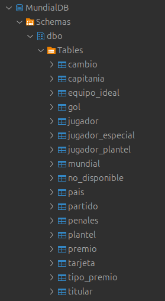

### 2. Base de Datos No Relacional (MongoDB - Destino)
Actúa como el destino final. Elegida por su flexibilidad y capacidad de manejar documentos jerárquicos (JSON). Los datos que originalmente estaban distribuidos en docenas de tablas en SQL Server, son transformados e incrustados dentro de colecciones independientes, favoreciendo lecturas atómicas súper veloces.

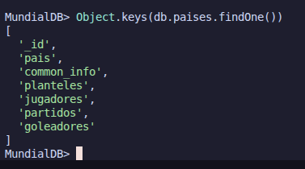

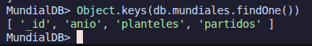

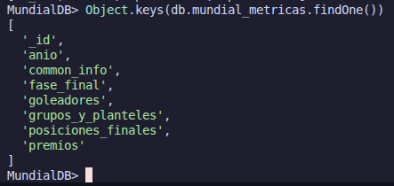

#### Acceso y Consultas en MongoDB (Terminal)

Para verificar la correcta inserción de los datos sin necesidad de un IDE externo, se puede utilizar la shell nativa de MongoDB (`mongosh`) directamente desde el contenedor.

**1. Comando para entrar al contenedor:**
```bash
docker exec -it mongo-mundial mongosh -u root -p password123
```
*   **`docker exec -it`**: Inicia una sesión interactiva dentro del contenedor.
*   **`-u root -p password123`**: Especifica las credenciales de superusuario para evitar errores de autorización.

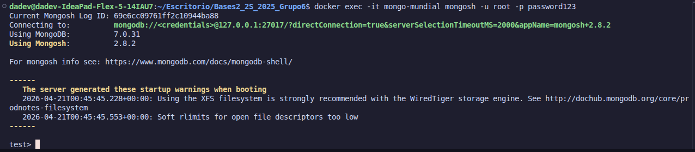

Se debe utilizar el comando use para acceder a la base de datos.

```bash
use MundialDB
```

**2. Comandos esenciales de consulta:**

Una vez dentro de la shell (`test>`), utiliza los siguientes comandos para navegar por tus datos:

| Comando | Descripción |
| :--- | :--- |
| `use MundialDB` | Selecciona la base de datos de trabajo. |
| `show collections` | Lista todas las colecciones (tablas NoSQL) disponibles. |
| `db.paises.find().pretty()` | Muestra todos los documentos de la colección de forma legible. |
| `db.paises.countDocuments()` | Cuenta el total de registros insertados. |
| `Object.keys(db.paises.findOne())` | Muestra todos los campos de un documento. |

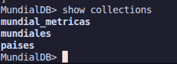


**3. Consulta específica: Argentina**

Para verificar los datos detallados de un país específico, como Argentina, se utiliza un filtro de búsqueda:

```javascript
db.paises.find({ pais: "Argentina" }).pretty()
```

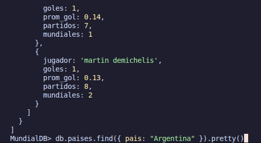

---

## Migración de la Colección: `paises`

Se ha implementado la lógica de migración para la colección principal de `paises`. 

### Estructura de la colección `paises`


### Lógica del Código (`seed.js`)

El script principal de migración (`seed.js`) está desarrollado en Node.js. Utiliza la librería `mssql` para ejecutar las rutinas en SQL Server y el driver nativo de `mongodb` para insertar los documentos.

**Paso a paso de la función `coleccion_paises()`:**

1. **Obtención de Países:** Se realiza una consulta dinámica (`SELECT nombre FROM pais`) para obtener la lista de los 90 países existentes en la base de datos relacional.
2. **Iteración Segura:** Se utiliza un bucle `for...of` que itera sobre cada país. El bucle cuenta con un bloque `try/catch` interno para garantizar que si un país genera un error por datos atípicos (ej. un *Divide by zero* en SQL por no tener partidos), el script registre el error pero **no se detenga**, continuando con el siguiente país.
3. **Ejecución del Stored Procedure:** Se llama a `sp_info_pais @pais, 'all'`, el cual retorna 5 tablas (recordsets) simultáneas:
   - Información General (Campeonatos, promedios).
   - Planteles (Agrupados históricamente).
   - Mundiales por Mundial.
   - Partidos (Resultados de encuentros).
   - Goleadores.
4. **Enriquecimiento de Datos:** Adicionalmente, se ejecuta un `SELECT * FROM jugadores_bonito WHERE pais = @pais` para obtener datos de redes sociales y nacimientos. Los atributos con valor `null` o el string literal `"[NULL]"` son depurados del objeto final para ahorrar espacio y mantener un JSON limpio.
5. **Upsert en MongoDB:** Utilizando la operación `replaceOne` con la bandera `{ upsert: true }`, se actualiza el documento si el país ya existe, o se inserta si es nuevo. Esto hace que el script sea completamente **idempotente** (se puede correr múltiples veces sin duplicar datos).
6. **Respaldo Local:** Al finalizar el procesamiento, un arreglo en memoria con toda la data se exporta físicamente al archivo `./data/paises_data.json` usando el módulo `fs`.

**Ejecución del script:**

Salida de una consulta hacia SQL Server desde un IDE:

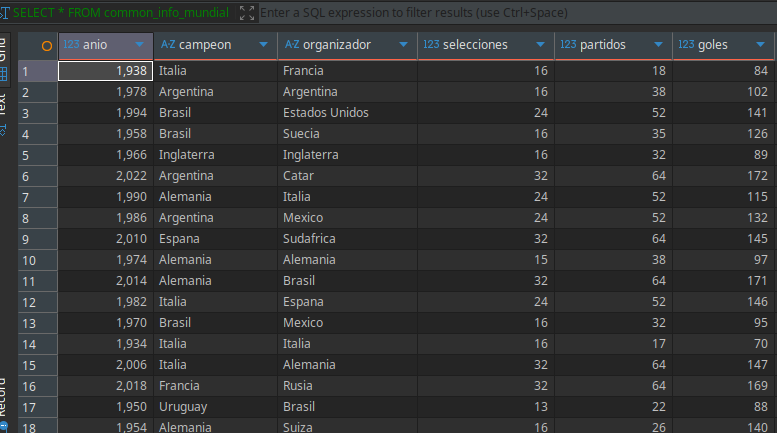

Cantidad de países obtenidos desde SQL Server:

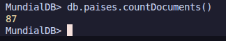

Consulta en MongoDB:


## Migración de la Colección de Mundiales

### Estructura de la colección `mundial`


### Explicación del código de la colección `mundial`

Esta colección se encarga de preservar el desarrollo histórico de cada torneo, enfocándose en la estructura de competencia (planteles) y el desarrollo de los encuentros (partidos).

**Paso a paso de la función `coleccion_mundial()`:**

1. **Iteración por Ediciones:** El script recorre un arreglo con los años de todos los mundiales celebrados hasta la fecha.
2. **Extracción de Planteles:** Se invoca la función `obtenerPlantelesConJugadores(anio)`, la cual consulta los grupos y las listas de buena fe de cada selección para ese mundial específico.
3. **Reconstrucción de Partidos:** Mediante `obtenerPartidos(anio)`, se recupera el calendario completo. Por cada partido, el script busca su `id_partido` único para realizar consultas adicionales sobre:
   - **Goles:** Minuto y autor.
   - **Tarjetas:** Tipo y tiempo.
   - **Penales:** Ejecutores y efectividad.
4. **Inserción Atómica:** Los datos se consolidan en un objeto JSON jerárquico y se insertan en la colección `mundiales` de MongoDB.

**Ejecución del script:**

Salida de una consulta hacia SQL Server desde un IDE:

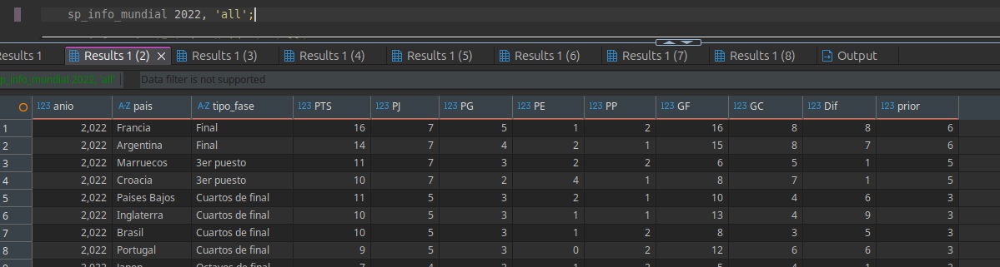

Cantidad de mundiales obtenidos desde SQL Server:

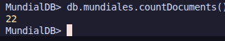

Consulta en MongoDB:

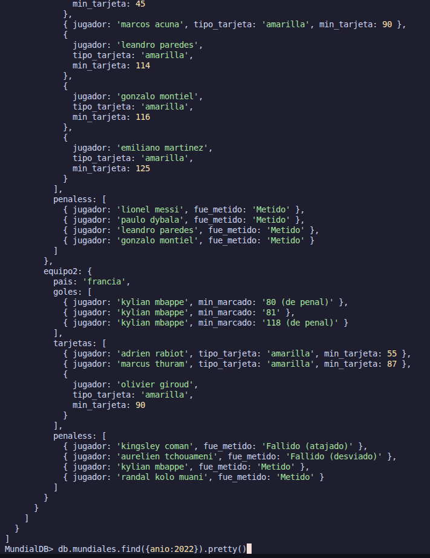

## Migración de la Colección de Métricas de Mundiales

El objetivo de esta colección es consolidar el éxito deportivo y las estadísticas individuales de cada edición, facilitando consultas de alto nivel sobre el palmarés del torneo.

### Estructura de la colección `mundial_metricas`


### Explicación del código de la colección `mundial_metricas`

**Paso a paso de la función `coleccion_metricas_mundial()`:**

1. **Extracción de Datos Maestros:** Se invoca `extraerMetricasMundial(anio)`, que a su vez ejecuta múltiples llamadas al procedimiento almacenado `sp_info_mundial` con diferentes parámetros:
   - `'common info'`: Para obtener al campeón, organizador y totales de goles/partidos.
   - `'fase final'`: Para los resultados de las etapas eliminatorias.
   - `'goleadores'`: Para el ranking de anotadores del torneo.
   - `'posiciones finales'`: Para la tabla general de rendimiento.
   - `'premios'`: Para los galardones individuales (Balón de Oro, Bota de Oro, etc.).
2. **Consolidación y Upsert:** Toda la información se unifica y se limpia de valores nulos. Luego, se realiza una operación `updateOne` con la bandera `{ upsert: true }` para asegurar que cada mundial sea único por su año.

**Ejecución del script:**

Salida de una consulta hacia SQL Server desde un IDE:

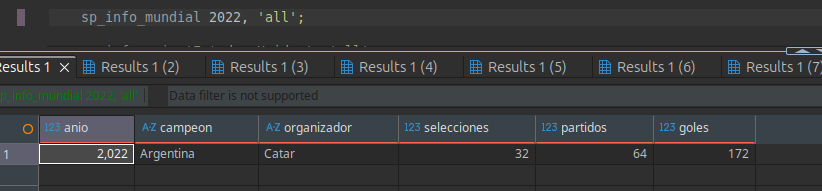

Cantidad de mundiales obtenidos desde SQL Server:

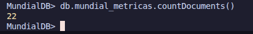

Consulta en MongoDB:

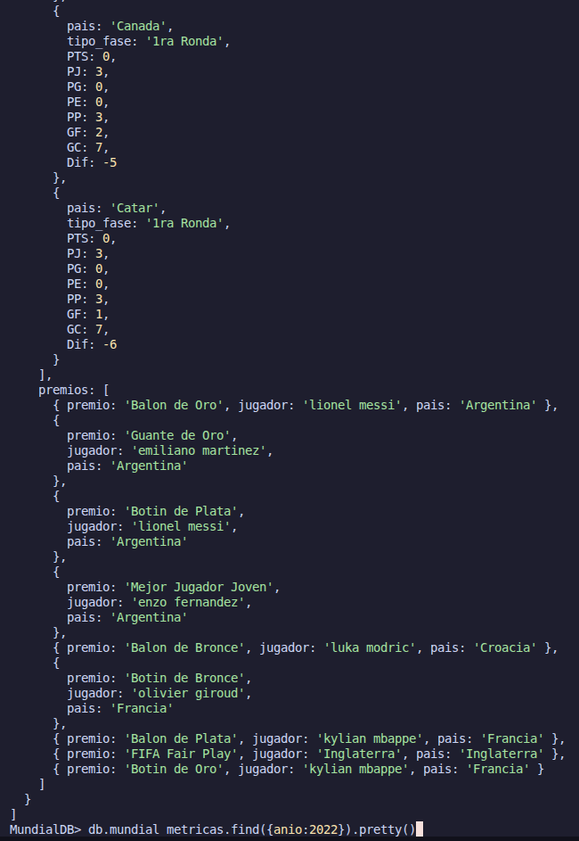

---

## Salida de Datos y Visualización (Colección MongoDB)

La salida de este script es un modelo JSON fuertemente anidado. En lugar de tener que hacer JOINS, MongoDB ahora guarda para cada país su perfil completo dentro de una sola colección llamada **`paises_data.json`**.

### Estructura de la Colección `paises`

Cada documento en la colección representa a un único país y contiene los siguientes sub-objetos y arreglos actúan como tablas embebidas:

- **`pais`** *(String)*: El identificador o nombre del país.
- **`common_info`** *(Objeto)*: Contiene las estadísticas consolidadas extraídas del primer recordset. Almacena la cantidad de mundiales jugados, arreglos de años en los que fue campeón/subcampeón o sede, y el conteo total de partidos, goles a favor, en contra y promedios.
- **`planteles`** *(Arreglo de Objetos)*: Historial de las plantillas nacionales. Cada objeto representa un mundial e incluye a su vez un sub-arreglo `equipo` con la información de los jugadores convocados (nombre, número de camisa y posición), omitiendo campos vacíos.
- **`jugadores`** *(Arreglo de Objetos)*: El catálogo único de jugadores (obtenido desde `jugadores_bonito`). Muestra la ficha oficial de los futbolistas que jugaron para ese país, incorporando datos limpios como `cumpleanios`, `height` (estatura), y enlaces a redes sociales si estos no son nulos.
- **`partidos`** *(Arreglo de Objetos)*: Registro plano de todos los encuentros disputados por el país en la historia de los mundiales. Incluye la etapa, año, oponentes (`Pais_1`, `Pais_2`) y el marcador.
- **`goleadores`** *(Arreglo de Objetos)*: Lista de los mayores anotadores históricos del país, incluyendo el total de goles, partidos y su promedio (`prom_gol`).

Debido a que representar todo este volumen de datos textualmente en este documento resulta extenso, se recomienda utilizar herramientas gráficas de anidamiento como **JSON Crack** (https://jsoncrack.com/editor). 

A continuación, se demuestra cómo queda esquematizada la estructura final del documento (tomando a **Argentina** como ejemplo):

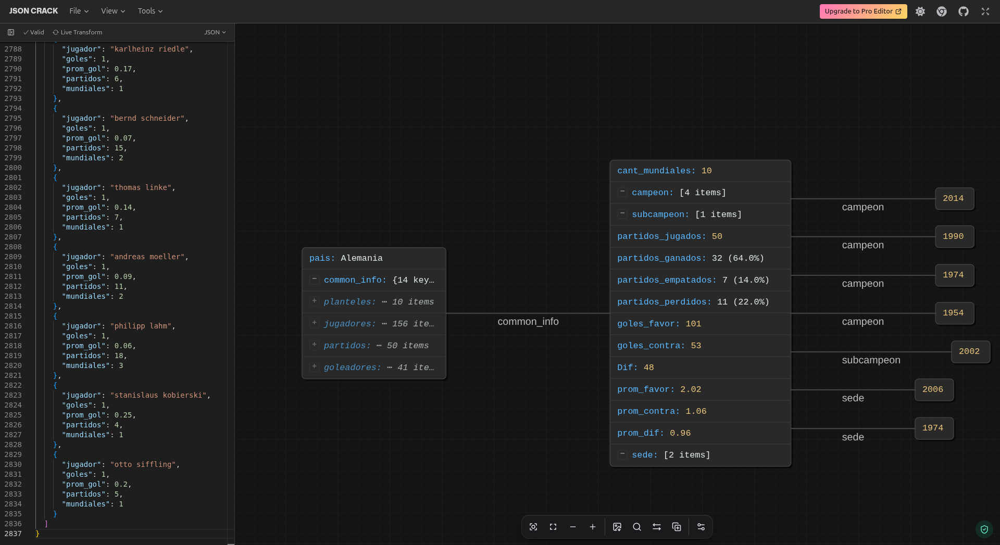

---
*Nota: El script está preparado para ser fácilmente extensible en caso de requerir el desglose completo evento por evento en la llave "partidos" mediante la integración futura del procedimiento sp_info_partido.*

---

## Store Procedures para MongoDB

A continuación se detallan los scripts de Node.js que simulan el comportamiento de Store Procedures para realizar consultas avanzadas sobre la base de datos MongoDB. La ejecución se realiza mediante la terminal utilizando Node.js.

### 1. `sp_mundial.js`
Este script permite obtener métricas y detalles específicos de una edición de la Copa del Mundo consultando la colección `mundial_metricas`.

**Uso:**
```bash
node sp_mundial <anio> <tipoInfo> [opcionales]
```

*   **Parámetros Obligatorios:**
    *   `<anio>`: Año del mundial (ej. 2022).
    *   `<tipoInfo>`: Tipo de información a consultar. Opciones válidas: `common_info`, `posiciones_finales`, `fase_final`, `goleadores`, `grupos_y_planteles`, `calendario`, `premios`, `equipo_ideal`.
*   **Parámetros Opcionales (formato llave=valor):**
    *   `grupo="<letra>"`, `pais="<nombre>"`, `fecha="<YYYY-MM-DD>"`.

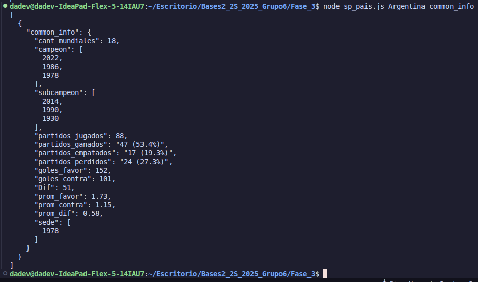

#### Explicación del Código (`sp_mundial.js`)

El script está diseñado para ser modular y reactivo a los parámetros de entrada:

1.  **Procesamiento de Argumentos (`checkParams`):** Valida los parámetros posicionales obligatorios y extrae parámetros opcionales del formato `llave=valor`, asignándolos a variables de filtrado global.
2.  **Enrutamiento Principal (`main`):** Dirige la ejecución a la función correspondiente según el `tipo_info` solicitado.
3.  **Lógica de Consultas:**
    *   **Consultas Simples:** Uso de `.find()` para obtener información directa del documento.
    *   **Agregaciones Dinámicas:** Se construyen pipelines de agregación (`aggregate`) que utilizan `$match` para filtrar el año y, opcionalmente, `$unwind` y `$match` adicional si se especificaron filtros de país, grupo o fecha dentro de los arreglos anidados.

### 2. `sp_pais.js`
Este script permite obtener información detallada de la participación histórica de un país consultando la colección `paises`.

**Uso:**
```bash
node sp_pais <pais> <tipoInfo> [opcionales]
```

*   **Parámetros Obligatorios:**
    *   `<pais>`: Nombre del país (ej. "Argentina").
    *   `<tipoInfo>`: Tipo de información a consultar. Opciones válidas: `common_info`, `planteles`, `mundial_por_mundial`, `resultados`, `goleadores`, `personas`.
*   **Parámetros Opcionales (formato llave=valor):**
    *   `ref_jugador="<referencia>"`, `anio=<numero>`.


#### Explicación del Código (`sp_pais.js`)

1.  **Validación de Entrada:** Asegura que el nombre del país y el tipo de consulta estén presentes. Procesa filtros extras para años específicos o referencias de jugadores.
2.  **Consultas Transversales:**
    *   La mayoría de las funciones realizan agregaciones sobre la colección `paises`, utilizando `$unwind` para acceder a elementos específicos de arreglos como `planteles` o `goleadores`.
    *   `get_mundial_por_mundial`: Es un caso especial que consulta la colección `mundial_metricas`, buscando la participación del país solicitado a través de todas las ediciones de los mundiales.

### 3. `sp_partidos.js`
Este script permite obtener detalles técnicos y eventos ocurridos durante los encuentros de un mundial específico consultando la colección `mundiales`.

**Uso:**
```bash
node sp_partidos <anio> <fecha> <pais> <tipoInfo>
```

*   **Parámetros Obligatorios:**
    *   `<anio>`: Año del mundial (ej. 2022).
    *   `<fecha>`: Fecha exacta del encuentro en formato YYYY-MM-DD (ej. "2022-11-22").
    *   `<pais>`: Nombre de uno de los países participantes.
    *   `<tipoInfo>`: Opciones válidas: `goles`, `penales`, `tarjetas`, `cambios`, `asistencias`.

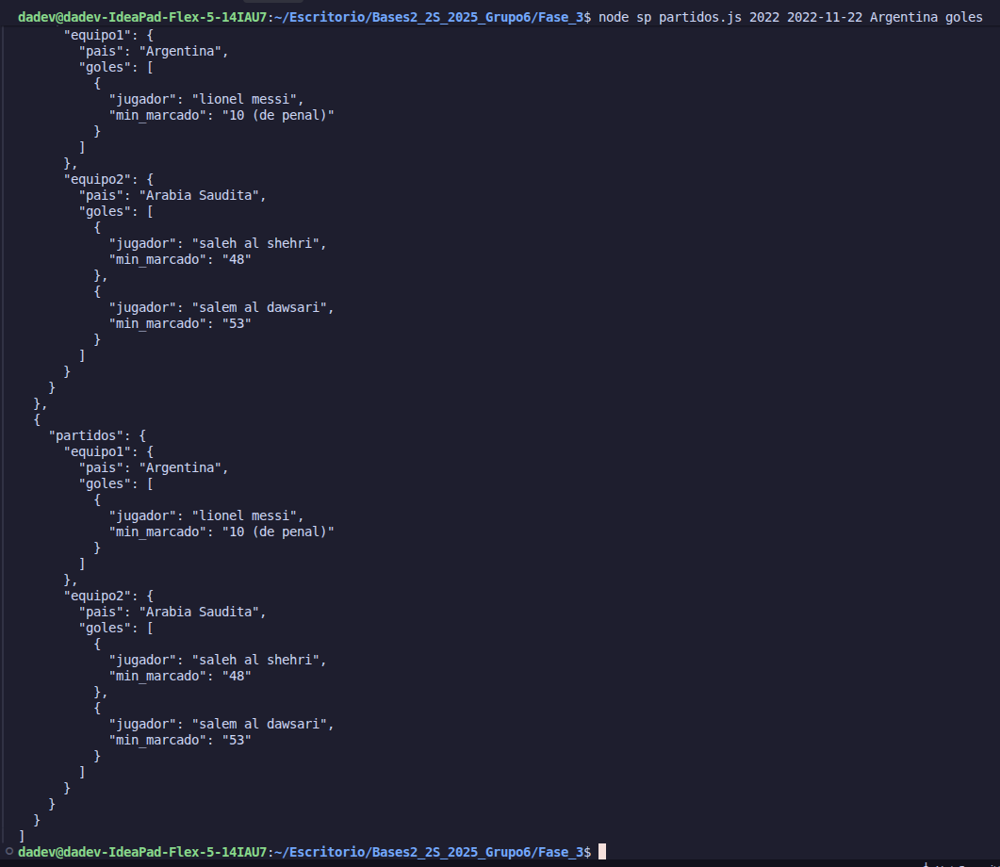

#### Explicación del Código (`sp_partidos.js`)

A diferencia de los anteriores, este script se enfoca exclusivamente en la colección `mundiales` y maneja una estructura de parámetros estrictamente posicional:

1.  **Localización de Partidos:** Utiliza un pipeline de agregación que primero filtra por el año (`$match: { anio }`).
2.  **Filtrado de Encuentro:** Realiza un `$unwind` del arreglo de partidos y busca aquel donde el país solicitado sea `equipo1` o `equipo2` Y coincida la fecha proporcionada.
3.  **Proyección Selectiva:** Según el `tipo_info`, proyecta campos específicos de los equipos participantes (ej. `partidos.equipo1.goles` y `partidos.equipo2.goles`), permitiendo visualizar eventos detallados sin cargar el documento completo.
